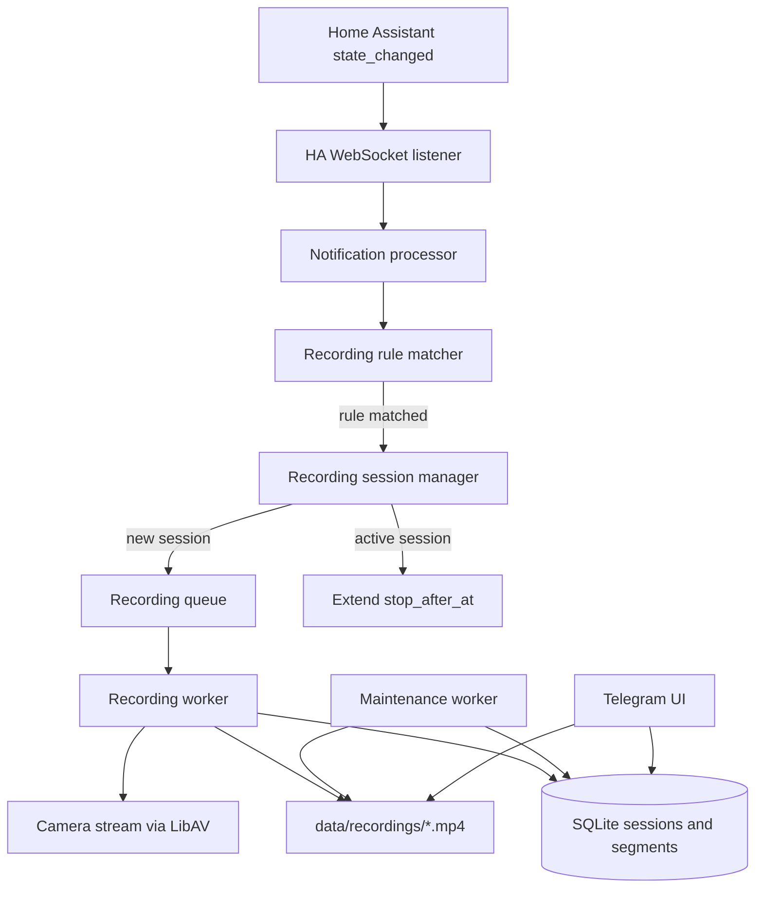
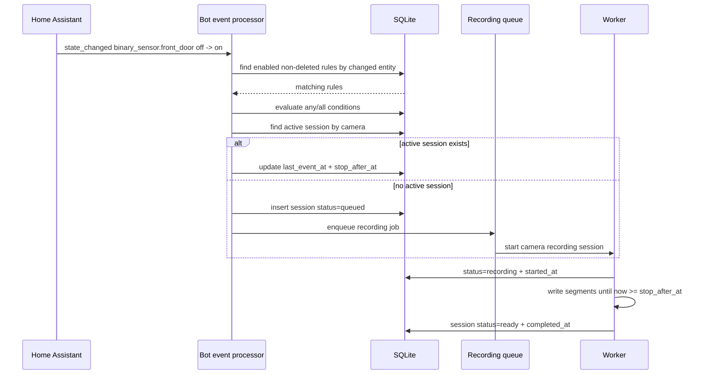

# Event Camera Recording Specification

## Цель

Добавить в Telegram HA Bot событийную запись камер: бот слушает события Home Assistant, сопоставляет их с правилами записи, сохраняет видеофрагменты локально и показывает реестр записей в Telegram с учетом пользовательских доступов.

Первый сценарий:

```text
Дверь открылась -> записать камеру "Коридор" 60 секунд -> хранить запись 30 дней
```

## Принципы

- Правила записи хранятся в боте, потому что архив, доступы, Telegram UI и файлы записей принадлежат боту.
- Home Assistant остается источником событий через `state_changed`.
- Видео хранится файлами на диске, в SQLite хранятся только метаданные.
- Запись запускается в фоне и не блокирует Telegram UI.
- Доступ к архиву наследуется от доступа к комнате/камере.
- Срок хранения настраивается глобально и может переопределяться в каждом правиле.

## MVP

В первой версии нужно реализовать:

- таблицу правил записи;
- таблицу условий правил;
- таблицу сессий записи;
- таблицу файловых сегментов записи;
- фоновую очередь задач записи;
- запуск записи по событию HA;
- сохранение mp4 в `data/recordings`;
- продление активной записи повторными событиями;
- нарезку длинной записи на файлы до 5 минут;
- очистку старых записей;
- Telegram-архив записей внутри карточки конкретной камеры;
- уведомление о готовой записи;
- админский интерфейс управления правилами;
- админскую настройку срока хранения по умолчанию;
- локализацию новых экранов `ru/en`.

В MVP не входит pre-roll, то есть запись начинается после получения события.

## User Flow

Админ создает правило:

```text
Админка
  -> Камеры
  -> Правила записи
  -> Добавить правило
```

Поля правила:

```text
Название: Дверь открыта
Условия: binary_sensor.front_door: off -> on
Логика условий: ИЛИ
Камера: Коридор
Писать после последнего события: 60 секунд
Максимум на файл: 300 секунд
Хранить: 30 дней
Включено: да
```

Если дверь открывается повторно, пока запись еще идет, новая запись не создается. Активная запись продлевается: таймер окончания снова сдвигается на `60 секунд` от момента последнего подходящего события.

Пользователь смотрит архив:

```text
Камеры
  -> Коридор
  -> Архив записей
  -> Дверь открыта · 02.06.2026 18:42 · 1м 20с
  -> Отправить видео
```

Архив открывается из карточки конкретной камеры, чтобы пользователь сразу видел записи, принадлежащие этой камере.

## Architecture



Текущие точки интеграции:

- `src/ha/event_listener.rs` уже получает `state_changed`.
- `src/core/notification.rs` уже обрабатывает события HA.
- `src/core/cameras.rs` уже умеет писать клипы через LibAV.
- `src/core/maintenance.rs` уже подходит для периодической очистки.
- `src/db/cameras.rs` уже содержит камеры и проверку доступов.
- В `main.rs` нужно создать отдельную очередь записи и передать sender в `AppConfig`, чтобы `notification processor` мог ставить задания, а worker обрабатывал их независимо от UI.

## Database

### `camera_recording_rules`

```sql
CREATE TABLE IF NOT EXISTS camera_recording_rules (
    id INTEGER PRIMARY KEY AUTOINCREMENT,
    name TEXT NOT NULL,
    camera_id INTEGER NOT NULL,
    condition_logic TEXT NOT NULL DEFAULT 'any',
    tail_seconds INTEGER NOT NULL DEFAULT 60,
    max_segment_seconds INTEGER NOT NULL DEFAULT 300,
    cooldown_s INTEGER NOT NULL DEFAULT 0,
    retention_days INTEGER NOT NULL DEFAULT 30,
    enabled INTEGER NOT NULL DEFAULT 1,
    last_completed_at TEXT,
    deleted_at TEXT,
    created_at TEXT NOT NULL DEFAULT CURRENT_TIMESTAMP,
    updated_at TEXT NOT NULL DEFAULT CURRENT_TIMESTAMP,
    FOREIGN KEY(camera_id) REFERENCES cameras(id),
    CHECK(condition_logic IN ('all', 'any'))
);
```

`tail_seconds` означает, сколько секунд продолжать запись после последнего подходящего события. Если во время активной записи событие повторилось, `stop_after_at` активной сессии сдвигается вперед на `tail_seconds`.

`max_segment_seconds` означает максимальную длительность одного mp4-файла. Если активная запись идет дольше, worker завершает текущий файл и сразу начинает следующий сегмент.

Индексы:

```sql
CREATE INDEX IF NOT EXISTS idx_camera_recording_rules_camera
ON camera_recording_rules(camera_id);

CREATE INDEX IF NOT EXISTS idx_camera_recording_rules_enabled
ON camera_recording_rules(enabled, deleted_at);
```

### `camera_recording_rule_conditions`

```sql
CREATE TABLE IF NOT EXISTS camera_recording_rule_conditions (
    id INTEGER PRIMARY KEY AUTOINCREMENT,
    rule_id INTEGER NOT NULL,
    entity_id TEXT NOT NULL,
    operator TEXT NOT NULL DEFAULT 'changed_to',
    from_state TEXT,
    to_state TEXT,
    value TEXT,
    created_at TEXT NOT NULL DEFAULT CURRENT_TIMESTAMP,
    FOREIGN KEY(rule_id) REFERENCES camera_recording_rules(id),
    CHECK(operator IN (
        'changed_to',
        'changed_from_to',
        'is',
        'is_not',
        'contains',
        'above',
        'below'
    ))
);
```

Популярные операторы условий для MVP:

```text
changed_to       entity changed to state
changed_from_to  entity changed from state to state
is               current state equals value
is_not           current state does not equal value
contains         current state contains value
above            numeric current state > value
below            numeric current state < value
```

Примеры:

```text
Дверь открылась:
  operator=changed_from_to
  entity_id=binary_sensor.front_door
  from_state=off
  to_state=on

Движение появилось:
  operator=changed_to
  entity_id=binary_sensor.motion_hall
  to_state=on

Сейчас ночь:
  operator=is
  entity_id=binary_sensor.night_mode
  value=on

Температура выше 28:
  operator=above
  entity_id=sensor.room_temperature
  value=28
```

Если у правила `condition_logic = 'any'`, достаточно одного условия, совпавшего с входящим событием. Если `condition_logic = 'all'`, хотя бы одно условие должно совпасть с входящим событием, а остальные условия правила должны быть истинными на текущем снимке состояний HA. Для `all` matcher должен после события запросить актуальные состояния остальных entity через HA client.

Для `all` важно различать событие и контекст:

- условие по entity, который только что изменился, проверяется через `from_state` и `to_state`;
- условия по остальным entity проверяются как текущий контекст через `operator` и `value`;
- `changed_to` и `changed_from_to` используются как событийные условия;
- `is`, `is_not`, `contains`, `above`, `below` используются как контекстные условия.

Индексы:

```sql
CREATE INDEX IF NOT EXISTS idx_camera_recording_rule_conditions_event
ON camera_recording_rule_conditions(entity_id, to_state);

CREATE INDEX IF NOT EXISTS idx_camera_recording_rule_conditions_rule
ON camera_recording_rule_conditions(rule_id);
```

### `camera_recording_sessions`

```sql
CREATE TABLE IF NOT EXISTS camera_recording_sessions (
    id INTEGER PRIMARY KEY AUTOINCREMENT,
    event_group_id TEXT NOT NULL,
    rule_id INTEGER NOT NULL,
    camera_id INTEGER NOT NULL,
    extended_by_rule_ids TEXT,
    trigger_summary TEXT NOT NULL,
    status TEXT NOT NULL,
    error TEXT,
    first_event_at TEXT NOT NULL,
    last_event_at TEXT NOT NULL,
    stop_after_at TEXT NOT NULL,
    started_at TEXT,
    completed_at TEXT,
    expires_at TEXT NOT NULL,
    notification_sent_at TEXT,
    deleted_at TEXT,
    created_at TEXT NOT NULL DEFAULT CURRENT_TIMESTAMP,
    FOREIGN KEY(rule_id) REFERENCES camera_recording_rules(id),
    FOREIGN KEY(camera_id) REFERENCES cameras(id)
);
```

Статусы сессии:

```text
queued
recording
ready
failed
deleted
```

Индексы:

```sql
CREATE INDEX IF NOT EXISTS idx_camera_recording_sessions_active
ON camera_recording_sessions(camera_id, status, deleted_at);

CREATE INDEX IF NOT EXISTS idx_camera_recording_sessions_camera_created
ON camera_recording_sessions(camera_id, created_at DESC);

CREATE INDEX IF NOT EXISTS idx_camera_recording_sessions_expires
ON camera_recording_sessions(expires_at, status, deleted_at);

CREATE INDEX IF NOT EXISTS idx_camera_recording_sessions_event_group
ON camera_recording_sessions(event_group_id);
```

### `camera_recording_segments`

```sql
CREATE TABLE IF NOT EXISTS camera_recording_segments (
    id INTEGER PRIMARY KEY AUTOINCREMENT,
    session_id INTEGER NOT NULL,
    camera_id INTEGER NOT NULL,
    segment_index INTEGER NOT NULL,
    file_path TEXT,
    duration_s INTEGER NOT NULL,
    size_bytes INTEGER,
    status TEXT NOT NULL,
    error TEXT,
    started_at TEXT,
    completed_at TEXT,
    expires_at TEXT NOT NULL,
    deleted_at TEXT,
    created_at TEXT NOT NULL DEFAULT CURRENT_TIMESTAMP,
    FOREIGN KEY(session_id) REFERENCES camera_recording_sessions(id),
    FOREIGN KEY(camera_id) REFERENCES cameras(id),
    UNIQUE(session_id, segment_index)
);
```

Статусы сегмента:

```text
queued
recording
ready
failed
deleted
```

Индексы:

```sql
CREATE INDEX IF NOT EXISTS idx_camera_recording_segments_session
ON camera_recording_segments(session_id, segment_index);

CREATE INDEX IF NOT EXISTS idx_camera_recording_segments_camera_created
ON camera_recording_segments(camera_id, created_at DESC);

CREATE INDEX IF NOT EXISTS idx_camera_recording_segments_expires
ON camera_recording_segments(expires_at, status, deleted_at);
```

## File Storage

Файлы хранить локально:

```text
data/recordings/YYYY/MM/DD/camera_<camera_id>_session_<session_id>_segment_<segment_index>.mp4
```

Пример:

```text
data/recordings/2026/06/02/camera_3_session_125_segment_1.mp4
```

`data/recordings` является storage root. В БД путь хранится относительно этого root, чтобы перенос контейнера/папки не ломал реестр:

```text
2026/06/02/camera_3_session_125_segment_1.mp4
```

Worker пишет видео только во временный файл:

```text
2026/06/02/.camera_3_session_125_segment_1.mp4.tmp
```

После успешного завершения сегмента выполняется atomic rename во внешний путь. В БД `file_path` заполняется только после rename. Это защищает UI и уведомления от отправки частично записанного файла.

## Event Matching



Правило срабатывает, если:

- `enabled = 1`;
- `deleted_at IS NULL`;
- `event.old_state != event.new_state`;
- хотя бы одно условие правила связано с `event.entity_id`;
- условия правила проходят по логике `condition_logic`.

Логика условий:

```text
any: правило срабатывает, если истинно хотя бы одно условие
all: правило срабатывает, если истинны все условия
```

Примеры:

```text
ИЛИ:
  binary_sensor.front_door: off -> on
  OR binary_sensor.motion_hall: off -> on

И:
  binary_sensor.front_door: off -> on
  AND binary_sensor.night_mode: * -> on
```

Для `from_state = NULL` старое состояние не проверяется. Для `to_state = NULL` новое состояние не проверяется.

Если активная сессия уже есть, новая сессия не создается. Вместо этого обновляются:

```text
last_event_at = now
stop_after_at = now + rule.tail_seconds
```

Это значит: пока события повторяются, запись продлевается. Когда события прекратились и `stop_after_at` прошел, worker завершает сессию.

Поиск активной сессии, продление сессии или создание новой сессии должны выполняться в одной DB-транзакции. Это нужно, чтобы два близких события не создали две активные сессии для одной камеры.

Одна камера может быть привязана к нескольким правилам. Если любое из этих правил сработало во время активной записи этой камеры, новая сессия не создается: текущая сессия продлевается. Это защищает от лишних worker-ов и ожидания в очереди.

Если новую активную сессию продлевает другое правило, его id добавляется в `extended_by_rule_ids`, а `trigger_summary` можно дополнить коротким текстом события. В MVP это поле можно хранить как JSON-массив строк/чисел.

Одно событие может запускать несколько правил для разных камер. Например `binary_sensor.front_door = on` может поставить в очередь запись с камеры "Коридор" и с камеры "Подъезд". Для каждой камеры создается своя активная сессия, если она еще не пишет.

`cooldown_s` применяется только после завершения сессии. Он защищает от немедленного создания новой сессии сразу после завершения предыдущей, но не мешает продлению активной записи.

Все сессии, созданные одним входящим событием HA, получают общий `event_group_id`. Это позволяет связать записи разных камер, которые появились от одного открытия двери.

## Recording Worker

Нужно добавить отдельный модуль:

```text
src/core/camera_recording.rs
```

Ответственность:

- принимает задания новых сессий записи;
- ограничивает параллелизм;
- обновляет статусы сессий и сегментов;
- сохраняет файлы сегментов;
- перечитывает `stop_after_at` после каждого сегмента;
- логирует ошибку, если запись не удалась.

Очередь:

```rust
tokio::sync::mpsc::channel::<RecordingJob>(32)
```

Эта очередь относится только к событийным архивным записям. Ручные действия пользователя из карточки камеры:

```text
📸 Снимок
🎞 10 секунд
```

остаются отдельными фоновыми задачами Telegram UI и не создают `camera_recording_sessions`. При этом оба механизма используют общий `src/core/cameras.rs`, поэтому общий LibAV/semaphore-лимит внутри модуля камер все равно защищает процесс от перегруза.

Интеграция с текущим runtime:

```rust
let (recording_tx, recording_rx) = tokio::sync::mpsc::channel::<RecordingJob>(32);

// AppConfig получает sender:
pub camera_recording_tx: tokio::sync::mpsc::Sender<RecordingJob>,

// main.rs запускает worker:
core::camera_recording::spawn_recording_worker(recording_rx, app_config.clone(), cancel_token.clone());
```

`process_and_dispatch` не должен ждать завершения записи. Он только матчится с правилами, продлевает активную сессию или создает `camera_recording_sessions` со статусом `queued` и отправляет `RecordingJob` в очередь. Если очередь заполнена, сессия переводится в `failed` с короткой причиной `recording queue is full`.

`RecordingJob` содержит `session_id`. При новой сессии worker запускает отдельную задачу записи для конкретной камеры. Если любое правило той же камеры снова срабатывает во время активной сессии, новый worker не создается: matcher только продлевает `stop_after_at`.

Параллелизм:

```text
до 4 одновременных событийных записей
```

Технически это должно быть реализовано через `Semaphore`: очередь принимает много `RecordingJob`, но одновременно выполняется не больше `camera_recording_max_parallel_jobs` активных сессий.

Алгоритм записи сессии:

```text
session.status = recording
session.started_at = now
segment_index = 1

loop:
  reload session.stop_after_at
  remaining = stop_after_at - now
  if remaining <= 0:
    break

  segment_duration = min(remaining, rule.max_segment_seconds)
  create camera_recording_segments row status=recording
  write tmp mp4 for segment_duration
  atomic rename tmp -> final mp4
  update segment status=ready, file_path, size_bytes, completed_at
  segment_index += 1

session.status = ready
session.completed_at = now
send ready notification
```

Важно: текущий `src/core/cameras.rs` уже содержит общий лимит LibAV-задач. Новый worker может переиспользовать существующий `capture_clip(camera, segment_duration)` для каждого сегмента. Если позже понадобится полностью бесшовная нарезка без малых пауз на границах файлов, нужно будет добавить отдельный LibAV pipeline с segment muxer.

## Suggested Types

```rust
pub struct RecordingRule {
    pub id: i64,
    pub name: String,
    pub camera_id: i64,
    pub condition_logic: ConditionLogic,
    pub tail_seconds: i64,
    pub max_segment_seconds: i64,
    pub cooldown_s: i64,
    pub retention_days: i64,
    pub enabled: bool,
    pub last_completed_at: Option<chrono::DateTime<chrono::Utc>>,
    pub deleted_at: Option<chrono::DateTime<chrono::Utc>>,
}

pub enum ConditionLogic {
    All,
    Any,
}

pub struct RecordingRuleCondition {
    pub id: i64,
    pub rule_id: i64,
    pub entity_id: String,
    pub from_state: Option<String>,
    pub to_state: Option<String>,
}

pub struct RecordingSession {
    pub id: i64,
    pub event_group_id: String,
    pub rule_id: i64,
    pub camera_id: i64,
    pub trigger_summary: String,
    pub status: RecordingSessionStatus,
    pub error: Option<String>,
    pub first_event_at: chrono::DateTime<chrono::Utc>,
    pub last_event_at: chrono::DateTime<chrono::Utc>,
    pub stop_after_at: chrono::DateTime<chrono::Utc>,
    pub started_at: Option<chrono::DateTime<chrono::Utc>>,
    pub completed_at: Option<chrono::DateTime<chrono::Utc>>,
    pub expires_at: chrono::DateTime<chrono::Utc>,
    pub notification_sent_at: Option<chrono::DateTime<chrono::Utc>>,
    pub deleted_at: Option<chrono::DateTime<chrono::Utc>>,
}

pub struct RecordingSegment {
    pub id: i64,
    pub session_id: i64,
    pub camera_id: i64,
    pub segment_index: i64,
    pub file_path: Option<String>,
    pub duration_s: i64,
    pub size_bytes: Option<i64>,
    pub status: RecordingSegmentStatus,
    pub error: Option<String>,
    pub started_at: Option<chrono::DateTime<chrono::Utc>>,
    pub completed_at: Option<chrono::DateTime<chrono::Utc>>,
    pub created_at: chrono::DateTime<chrono::Utc>,
    pub expires_at: chrono::DateTime<chrono::Utc>,
    pub deleted_at: Option<chrono::DateTime<chrono::Utc>>,
}

pub enum RecordingSessionStatus {
    Queued,
    Recording,
    Ready,
    Failed,
    Deleted,
}

pub enum RecordingSegmentStatus {
    Queued,
    Recording,
    Ready,
    Failed,
    Deleted,
}
```

## Telegram UI

### Пользовательский раздел

```text
📹 Камеры
────────────────────
📹 Коридор
📹 Подъезд
```

Карточка камеры:

```text
📹 Коридор
────────────────────
📸 Снимок
🎞 10 секунд
🗂 Архив записей
```

Записи камеры:

```text
📹 Коридор · Архив
────────────────────
🚪 Дверь открыта
02.06.2026 18:42 · 1м 20с · 1 файл · хранится до 02.07.2026

🚪 Дверь открыта
02.06.2026 21:13 · 12м 10с · 3 файла · хранится до 02.07.2026
```

По умолчанию в архиве камеры показываются записи за срок хранения, заданный в настройках. В будущем можно добавить быстрые фильтры:

```text
24ч
7д
30д
Все
```

Карточка записи:

```text
🎞 Запись
────────────────────
Камера: Коридор
Событие: Дверь открыта
Начало: 02.06.2026 18:42
Конец: 02.06.2026 18:43
Длительность: 1м 20с
Файлов: 1
Хранить до: 02.07.2026
```

Кнопки:

```text
🎞 Отправить видео
🎞 Отправить все части
🗑 Удалить
⬅️ Назад
```

Если у сессии один сегмент, показывается `🎞 Отправить видео`. Если сегментов несколько, показывается `🎞 Отправить все части`, а бот отправляет файлы по порядку `segment_index`.

Если запись еще идет:

```text
⏳ Запись еще идет...
```

Если запись упала:

```text
⚠️ Запись не удалась
```

### Админский раздел

```text
Админка
  -> 📹 Камеры
  -> ⚙️ Правила записи
```

Экран правил:

```text
⚙️ Правила записи камер
────────────────────
✅ Дверь открыта -> Коридор · 60с · 30д
⏸ Движение ночью -> Подъезд · 45с · 14д
```

Действия:

```text
➕ Добавить правило
✏️ Изменить
⏯ Вкл/выкл
🗑 Удалить
```

Добавление правила можно сделать через пошаговый wizard:

1. Выбор камеры.
2. Выбор логики условий: `И` или `ИЛИ`.
3. Добавление одного или нескольких условий `entity_id`, `from_state`, `to_state`.
4. Ввод времени записи после последнего события.
5. Ввод максимальной длительности одного файла.
6. Ввод cooldown после завершения сессии.
7. Ввод срока хранения.
8. Ввод названия.
9. Подтверждение.

## Access Control

Пользователь видит запись, если:

- запись принадлежит камере;
- камера принадлежит комнате;
- пользователь имеет доступ к этой комнате;
- или пользователь является админом.

Удалять записи может:

- админ;
- в будущем можно добавить право `can_delete_recordings`.

## Settings

Настройки делятся на два уровня:

- пользовательские значения правил хранятся в `camera_recording_rules`;
- технические лимиты и пути лучше хранить в `options.json`, потому что они влияют на runtime и Docker volume;
- глобальные дефолты можно хранить в `app_settings`, если ими нужно управлять из админки без перезапуска.

Рекомендуемые поля `options.json`:

```text
camera_recording_max_tail_seconds = 300
camera_recording_max_segment_seconds = 300
camera_recording_max_parallel_jobs = 4
camera_recording_storage_root = data/recordings
```

Рекомендуемые ключи `app_settings`:

```text
camera_recording_default_tail_seconds = 60
camera_recording_default_max_segment_seconds = 300
camera_recording_default_cooldown_s = 0
camera_recording_default_retention_days = 30
camera_recording_max_storage_mb = 0
```

В админке нужно дать возможность менять:

- `camera_recording_default_retention_days`;
- `camera_recording_max_storage_mb`.

Новые правила получают срок хранения по умолчанию из `camera_recording_default_retention_days`, но конкретное правило может иметь свой `retention_days`.

На первом этапе можно оставить технические лимиты константами, а в UI вынести поля самого правила:

- время записи после последнего события;
- максимум одного файла;
- cooldown;
- срок хранения.

## Maintenance

В `src/core/maintenance.rs` добавить очистку:

```text
каждые 30-60 минут:
  найти camera_recording_sessions where expires_at < now and status in (ready, failed)
  найти связанные camera_recording_segments
  удалить файлы сегментов, если есть
  выставить session.status=deleted, deleted_at=now
  выставить segments.status=deleted, deleted_at=now, file_path=NULL
```

В MVP выбран единый подход: физический файл удаляется, строка в SQLite остается со статусом `deleted`. Так реестр не теряет историю, а диск очищается предсказуемо.

При старте сервиса нужно восстановить незавершенные записи после возможного перезапуска:

```text
camera_recording_sessions.status in (queued, recording)
  -> session.status=failed
  -> session.error="service restarted before recording completed"

camera_recording_segments.status in (queued, recording)
  -> segment.status=failed
  -> удалить tmp-файл, если он остался
```

Это можно сделать в `spawn_recording_worker` перед началом чтения очереди или отдельной функцией `recover_stale_recordings`. На старте все старые `queued/recording` считаются потерянными, потому что in-memory очередь и активные worker-задачи не переживают перезапуск процесса.

## Notifications

Уведомление о готовой записи входит в MVP:

```text
🚪 Дверь открыта
🎞 Запись с камеры "Коридор" готова · 1м 20с · 1 файл
```

Получатели:

- подписчики датчика;
- `root_user`.

Чтобы не спамить, для MVP уведомление отправляется только `root_user` и подписчикам датчика. Пользователи с доступом к комнате могут найти запись в архиве камеры без отдельного push-сообщения.

Уведомление отправляется один раз после завершения сессии, когда `camera_recording_sessions.status = ready`. Для сессий из нескольких сегментов уведомление отправляется после готовности последнего сегмента.

Получателей нужно дедуплицировать: если `root_user` также подписан на датчик, он получает одно сообщение.

## Error Handling

Если запись не удалась:

- `camera_recording_sessions.status = failed`;
- текущий `camera_recording_segments.status = failed`;
- `error` содержит короткую причину;
- `file_path` не указывается для неготового сегмента;
- правило не отключается автоматически.

Если один сегмент успешно записался, а следующий упал, сессия считается `failed`, но готовые сегменты остаются доступными в архиве. В карточке записи нужно показать предупреждение, что запись завершилась с ошибкой и доступна только частично.

Если камера недоступна часто, можно добавить счетчик ошибок в будущем:

```text
failed_count
last_error_at
```

После N ошибок бот может показывать предупреждение в админке.

## Security

- Не отправлять абсолютные пути к файлам пользователю.
- Проверять доступ к камере перед отправкой видео.
- Не разрешать пользователю вручную запрашивать произвольный путь файла.
- Не хранить RTSP URL в тексте ошибок, которые уходят в Telegram.
- Учитывать размер файла перед отправкой в Telegram.
- Если сегмент слишком большой для отправки или Telegram отклонил upload, запись остается в архиве, а пользователь получает понятную ошибку.

## Limits

Рекомендуемые лимиты MVP:

```text
tail_seconds: 5..300
max_segment_seconds: 30..300
cooldown_s: 0..86400
retention_days: 1..365
parallel recording jobs: 1..4, default 4
recording queue size: 32
```

## Queue Overflow

Тут есть два разных ограничения.

Первое: **параллельные активные записи**.

```text
camera_recording_max_parallel_jobs = 4
```

Это именно количество камер/сессий, которые реально пишутся одновременно. Для домашней установки разумный дефолт `4`: обычно камер немного, и нет смысла искусственно ограничивать запись одной камерой.

Если камер больше лимита, лишние новые сессии ждут в очереди. Повторные события по уже активной камере в очередь не попадают и только продлевают текущую сессию.

Второе: **размер очереди ожидания**.

```text
recording queue size = 32
```

Это количество новых сессий, которые могут ждать свободного worker-а. Очередь нужна, чтобы всплеск событий не забил память и не повесил сервис.

Поведение MVP:

```text
если очередь заполнена:
  создать/обновить session не нужно
  если session уже создана в транзакции, перевести ее в failed
  error="recording queue is full"
  не запускать worker
  залогировать warn
```

Пользовательское поведение:

- в архиве такая сессия отображается как `⚠️ Запись не началась`;
- файл отправить нельзя, потому что сегментов нет;
- root_user может увидеть ошибку в карточке записи;
- обычному пользователю показывается короткий текст без внутренних деталей.

Почему не ставить задачу бесконечно в очередь: если событий много, старые задачи быстро теряют смысл, а камера/LibAV все равно физически не успеют записать все одновременно.

Важно: если активная сессия уже пишет камеру, повторное событие не попадает в очередь. Оно только продлевает `stop_after_at` существующей сессии.

## Partial Recordings

Частично успешная запись возникает, если один или несколько сегментов уже готовы, но следующий сегмент упал.

Пример:

```text
segment_1 = ready
segment_2 = ready
segment_3 = failed
session.status = failed
```

UI:

```text
⚠️ Запись завершилась с ошибкой
Доступно: 2 из 3 частей
```

Поведение:

- готовые сегменты остаются в архиве;
- пользователь может отправить готовые части;
- кнопка `🎞 Отправить все части` отправляет только `ready` сегменты по порядку;
- в карточке показывается короткая причина ошибки;
- уведомление “готова” для такой сессии не отправляется;
- root_user можно уведомить об ошибке отдельным сообщением позже, но это не входит в MVP.

Удаление:

- при удалении частичной записи удаляются все готовые файлы сегментов;
- failed-сегменты переводятся в `deleted`, даже если файла нет.

## Storage Quota

Срок хранения решает большую часть задачи, но квота нужна как защита от переполнения диска.

Для MVP можно начать без UI-квоты, но в `options.json` стоит предусмотреть технический лимит:

```text
camera_recording_max_storage_mb = 0
```

`0` означает, что квота отключена.

Если квота включена:

```text
посчитать общий размер ready-сегментов
если размер > camera_recording_max_storage_mb:
  удалить самые старые ready/failed сессии
  пока размер не станет ниже лимита
```

Правила удаления:

- сначала удаляются записи с истекшим `expires_at`;
- затем самые старые записи по `created_at`;
- активные `queued/recording` сессии не удаляются;
- запись удаляется целиком сессией, а не отдельными сегментами;
- строки в SQLite остаются со статусом `deleted`.

Если места на диске не хватает во время записи:

- текущий сегмент получает `failed`;
- сессия получает `failed`;
- готовые предыдущие сегменты остаются доступными как partial recording;
- ошибка не должна содержать RTSP URL или абсолютный путь.

## Acceptance Criteria

Фича считается готовой для MVP, если выполняются следующие условия.

### Rules

- админ может создать правило записи для камеры;
- правило содержит одну или несколько условий;
- правило поддерживает `И` и `ИЛИ`;
- условие поддерживает `entity_id`, `operator`, `from_state`, `to_state`, `value`;
- доступны операторы `changed_to`, `changed_from_to`, `is`, `is_not`, `contains`, `above`, `below`;
- правило можно включить, выключить и удалить;
- срок хранения по умолчанию равен 30 дням;
- срок хранения по умолчанию можно изменить в админке;
- глобальную квоту `camera_recording_max_storage_mb` можно изменить в админке;
- конкретное правило может переопределить срок хранения.

### Event Matching

- событие `off -> on` запускает правило с `from_state=off`, `to_state=on`;
- событие `unavailable -> on` не запускает правило `off -> on`;
- оператор `is` проверяет текущее состояние;
- оператор `is_not` проверяет, что текущее состояние отличается от значения;
- оператор `contains` проверяет подстроку;
- операторы `above` и `below` корректно работают с числовыми состояниями;
- правило `ИЛИ` запускается при совпадении любого условия;
- правило `И` запускается только если входящее событие совпало с одним условием, а остальные условия истинны по текущему HA-состоянию;
- одно HA-событие может создать сессии для нескольких камер;
- созданные сессии получают одинаковый `event_group_id`.

### Recording Session

- при первом совпадении создается `camera_recording_sessions` со статусом `queued`;
- worker переводит сессию в `recording`;
- повторное событие во время активной сессии не создает дубль;
- повторное событие обновляет `last_event_at` и продлевает `stop_after_at`;
- другое правило той же камеры во время активной сессии тоже продлевает текущую сессию;
- для одной камеры одновременно существует не больше одной active-сессии;
- когда `stop_after_at` прошел, worker завершает сессию;
- готовая сессия получает `status=ready`, `completed_at` и `notification_sent_at`.

### Segments

- запись пишется сегментами не длиннее `max_segment_seconds`;
- сегмент сначала пишется во временный `.tmp`;
- `file_path` появляется в БД только после успешного rename;
- если запись дольше 5 минут, создается следующий сегмент;
- сегменты отправляются пользователю по `segment_index`;
- частично успешная запись показывает готовые сегменты и предупреждение.

### Access

- пользователь видит архив только доступных камер;
- доступ к архиву наследуется от доступа к комнате камеры;
- пользователь без доступа не может получить сегмент по callback payload;
- root_user видит все записи;
- удалять записи может только админ/root_user.

### Notifications

- после готовой сессии отправляется одно уведомление;
- получатели: `root_user` и подписчики датчика;
- получатели дедуплицируются;
- повторная отправка не происходит, если `notification_sent_at` заполнен;
- для failed/partial сессии обычное уведомление “готова” не отправляется.

### Maintenance

- просроченные записи удаляются с диска;
- строки в БД переводятся в `deleted`;
- после перезапуска старые `queued/recording` переводятся в `failed`;
- tmp-файлы от незавершенных сегментов удаляются;
- очистка не удаляет активные записи.
- если включена storage quota, cleanup удаляет самые старые неактивные сессии до возврата ниже лимита.

## Test Plan

### Unit Tests

- CRUD правил записи;
- CRUD условий правил;
- создание сессии;
- создание сегмента;
- soft-delete сессии и сегментов;
- расчет `expires_at`;
- расчет `stop_after_at`;
- расчет занятого места архива;
- форматирование статусов для UI;
- дедупликация получателей уведомлений.

### Rule Matcher Tests

Проверить `from_state` / `to_state`:

```text
rule: binary_sensor.door off -> on
event: off -> on
result: match

rule: binary_sensor.door off -> on
event: unavailable -> on
result: no match
```

Проверить `ИЛИ`:

```text
rule:
  door off -> on
  OR motion off -> on
event: motion off -> on
result: match
```

Проверить `И`:

```text
rule:
  door off -> on
  AND night_mode * -> on
event: door off -> on
ha current night_mode: on
result: match

ha current night_mode: off
result: no match
```

Проверить популярные операторы:

```text
operator=is
current state: on
value: on
result: match

operator=is_not
current state: off
value: on
result: match

operator=contains
current state: motion_detected
value: motion
result: match

operator=above
current state: 29.5
value: 28
result: match

operator=below
current state: 19
value: 20
result: match
```

### Session Tests

- первое событие создает новую сессию;
- повторное событие продлевает существующую сессию;
- повторное событие не создает вторую активную сессию;
- другое событие/правило той же камеры продлевает существующую сессию;
- разные камеры могут писать параллельно до `camera_recording_max_parallel_jobs`;
- два правила на одно событие создают две сессии с одним `event_group_id`;
- cooldown после завершения не дает сразу создать новую сессию;
- cooldown не мешает продлевать активную сессию.

### Worker Tests

- worker пишет один сегмент;
- worker пишет несколько сегментов при длинной записи;
- сегмент получает `file_path` только после успешного rename;
- при ошибке сегмента сессия становится `failed`;
- готовые сегменты partial-записи остаются доступными;
- очередь переполнена -> сессия `failed`;
- semaphore ограничивает число параллельных активных сессий.

### Maintenance Tests

- просроченная ready-сессия удаляет файлы;
- просроченная failed-сессия удаляет готовые сегменты;
- active-сессии не удаляются;
- recovery переводит старые `queued/recording` в `failed`;
- recovery удаляет tmp-файлы.
- storage quota удаляет самые старые ready/failed сессии;
- storage quota не удаляет active-сессии.

### Telegram UI Tests

- камера показывает кнопку `Архив записей`;
- архив показывает только записи выбранной камеры;
- карточка с одним сегментом показывает `Отправить видео`;
- карточка с несколькими сегментами показывает `Отправить все части`;
- partial-запись показывает предупреждение;
- пользователь без доступа не получает файл;
- root_user получает доступ ко всем архивам.
- админ может изменить `camera_recording_max_storage_mb`.

### Manual Integration Tests

1. Создать правило `door off -> on`, открыть дверь, убедиться что запись появилась в архиве.
2. Открыть дверь повторно во время записи, убедиться что сессия продлилась, а дубль не появился.
3. Сделать `tail_seconds` больше `max_segment_seconds`, убедиться что появилось несколько сегментов.
4. Создать два правила на одно событие для разных камер, убедиться что обе записи имеют один `event_group_id`.
5. Перезапустить сервис во время записи, убедиться что старая сессия стала `failed`.
6. Уменьшить срок хранения или выставить старый `expires_at`, убедиться что cleanup удалил файлы.

## Implementation Plan

### Stage 1: Data model

- добавить миграцию с `camera_recording_rules`;
- добавить миграцию с `camera_recording_rule_conditions`;
- добавить миграцию с `camera_recording_sessions`;
- добавить миграцию с `camera_recording_segments`;
- добавить `src/db/camera_recording_rules.rs`;
- добавить `src/db/camera_recording_rule_conditions.rs`;
- добавить `src/db/camera_recording_sessions.rs`;
- добавить `src/db/camera_recording_segments.rs`;
- подключить модули в `src/db/mod.rs`;
- покрыть простыми тестами CRUD и cleanup selection.

### Stage 2: Worker

- добавить `src/core/camera_recording.rs`;
- создать `RecordingJob`;
- добавить spawn-функцию worker-а;
- подключить worker в `main.rs`;
- добавить `camera_recording_tx` в `AppConfig`;
- использовать `core::cameras::capture_clip`;
- сохранять mp4 в `data/recordings/...`;
- обновлять статусы.

### Stage 3: Event integration

- в `process_and_dispatch` после записи event log вызвать matcher правил;
- найти подходящие правила;
- проверить условия `any/all`;
- найти активную сессию по camera;
- если активная сессия есть, обновить `last_event_at` и `stop_after_at`;
- если активной сессии нет, проверить cooldown после прошлой завершенной сессии;
- создать `camera_recording_sessions` со статусом `queued`;
- отправить задания в worker queue через `AppConfig.camera_recording_tx`.

### Stage 4: Telegram archive

- добавить payload-и для архива;
- добавить кнопку `Архив записей` в карточку камеры;
- добавить экран списка сессий записи камеры;
- добавить экран карточки сессии записи;
- добавить отправку одного сегмента;
- добавить отправку всех сегментов сессии по порядку;
- добавить удаление записи админом.

### Stage 5: Admin rule UI

- добавить раздел `Правила записи`;
- добавить wizard создания правила;
- добавить управление условиями `И` / `ИЛИ`;
- добавить вкл/выкл;
- добавить удаление;
- добавить редактирование основных числовых полей.
- добавить настройку срока хранения по умолчанию.

### Stage 6: Maintenance

- добавить очистку просроченных файлов;
- добавить восстановление потерянных `queued/recording` после перезапуска;
- добавить логирование количества удаленных записей;
- добавить тесты для cleanup.

### Stage 7: Notifications

- отправлять уведомление после завершения сессии;
- отправлять только `root_user` и подписчикам датчика;
- дедуплицировать получателей;
- не отправлять повторное уведомление, если `notification_sent_at` уже заполнен.

### Stage 8: Localization

- добавить ключи `ru/en` для:
  - архива;
  - правил записи;
  - уведомлений о готовой записи;
  - статусов записи;
  - ошибок;
  - подтверждений удаления.

## Future Improvements

### Pre-roll

Запись "за 5 секунд до события" невозможна без постоянного буфера. Возможные варианты:

- использовать возможности go2rtc/HA, если доступен API записи буфера;
- держать постоянный ring-buffer в боте;
- использовать внешний NVR.

Это лучше не включать в MVP.

### Smarter session grouping

В MVP повторные события уже продлевают активную сессию. В будущем можно добавить более умную группировку: например, показывать в карточке записи все события, которые продлевали сессию, с точными временами.

### Per-rule recipients

В будущем правило может иметь настройки уведомлений:

```text
уведомлять админов
уведомлять подписчиков датчика
уведомлять пользователей комнаты
```

### External Storage Upload

В будущем можно добавить выгрузку готовых сегментов во внешнее хранилище:

```text
SMB / Samba share
FTP
SFTP
WebDAV
S3-compatible storage
```

Это не входит в MVP. В MVP файлы лежат локально в `data/recordings`, а внешняя выгрузка должна быть дополнительным слоем поверх готовых сегментов.

Рекомендуемая модель:

```text
segment ready locally
  -> upload worker
  -> external storage
  -> update segment.remote_url / remote_path / upload_status
```

Для будущей реализации стоит добавить поля в `camera_recording_segments`:

```sql
upload_status TEXT,
remote_path TEXT,
remote_url TEXT,
uploaded_at TEXT,
upload_error TEXT
```

Статусы upload:

```text
disabled
pending
uploading
uploaded
failed
```

Настройки:

```text
recording_storage_backend = local
recording_upload_enabled = false
recording_upload_backend = smb | ftp | sftp | webdav | s3
recording_upload_delete_local_after_upload = false
```

Важные правила:

- локальный файл остается источником истины в MVP;
- upload не должен блокировать запись следующего сегмента;
- если upload упал, локальная запись остается доступной;
- credentials нельзя показывать в Telegram и логах;
- если включено `delete_local_after_upload`, Telegram должен уметь отправлять файл из внешнего storage или показывать понятную ошибку;
- для SMB/FTP лучше делать отдельный upload worker с retry/backoff.

UI будущей версии:

```text
Админка
  -> Камеры
  -> Хранилище записей
  -> Локально / SMB / FTP / ...
```

Для каждого сегмента в архиве можно показывать:

```text
☁️ Загружено
⚠️ Ошибка загрузки
⏳ Ожидает загрузки
```

## MVP Decisions

- уведомления о готовой записи нужны;
- получатели уведомлений: `root_user` и подписчики датчика;
- одно событие может запускать несколько камер через несколько правил;
- повторное событие во время активной записи продлевает текущую сессию;
- запись режется на сегменты максимум по 5 минут;
- файл сегмента пишется во временный путь и публикуется через atomic rename;
- правила поддерживают логические операции `И` / `ИЛИ`;
- условия поддерживают популярные операторы: `changed_to`, `changed_from_to`, `is`, `is_not`, `contains`, `above`, `below`;
- условия поддерживают `from_state`, `to_state` и `value`;
- срок хранения по умолчанию: 30 дней;
- срок хранения по умолчанию должен редактироваться в админке;
- лимит архива `camera_recording_max_storage_mb` должен редактироваться в админке;
- архив находится внутри карточки конкретной камеры.
