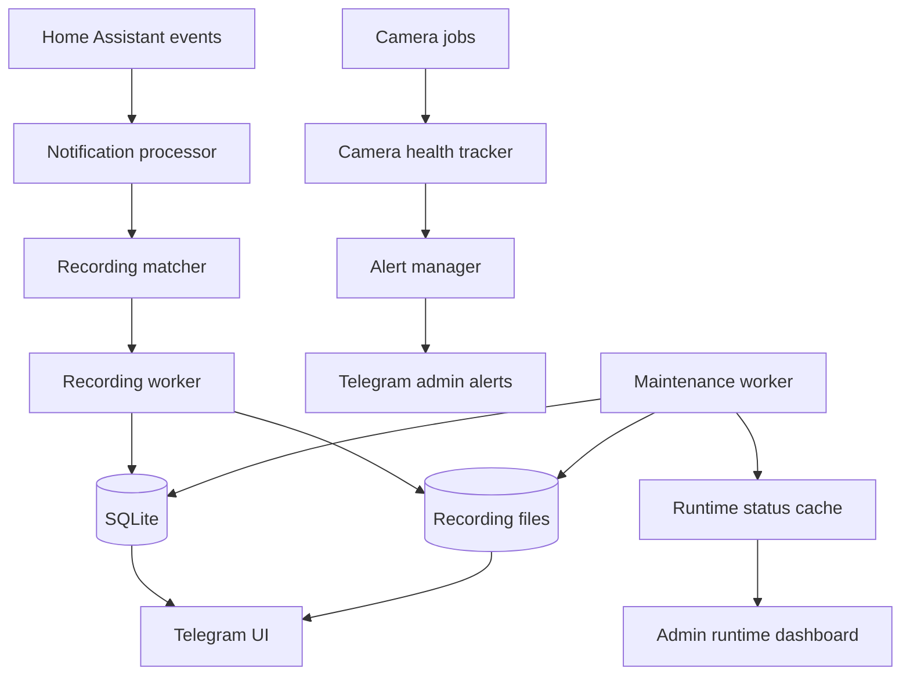
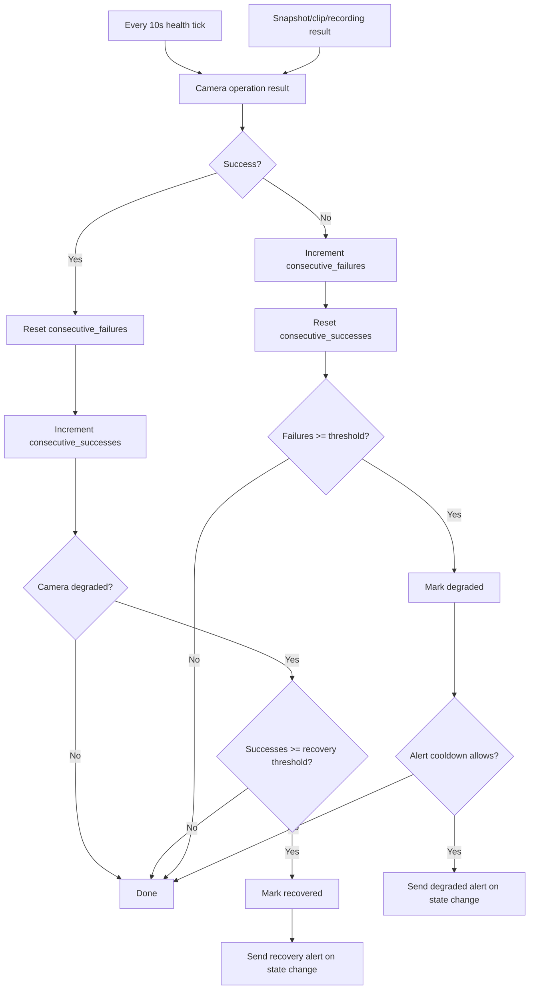
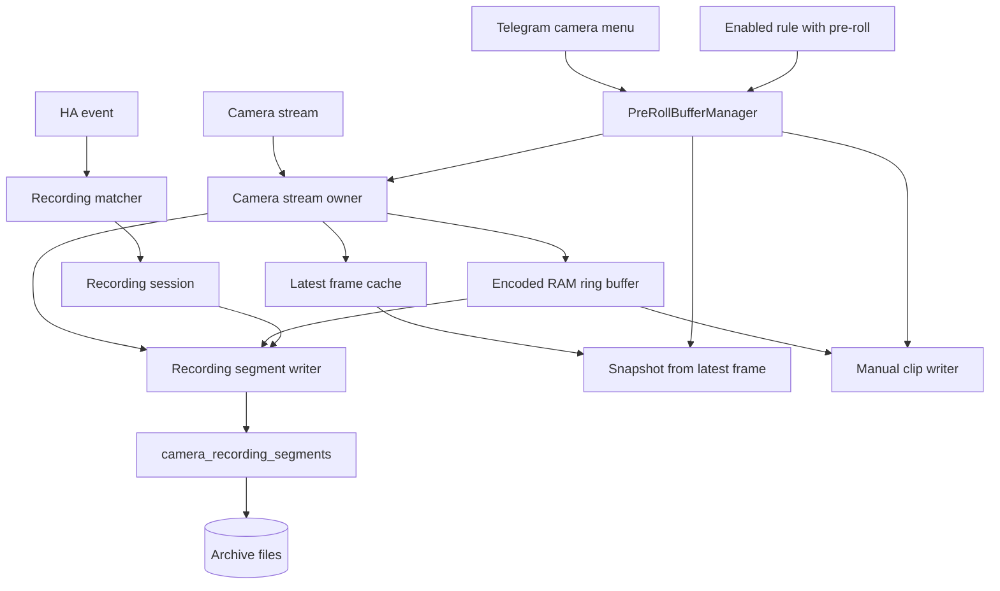
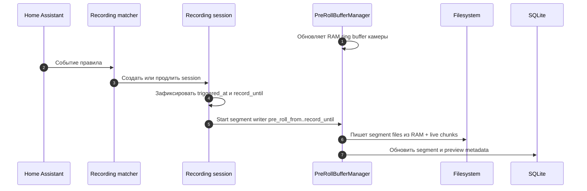
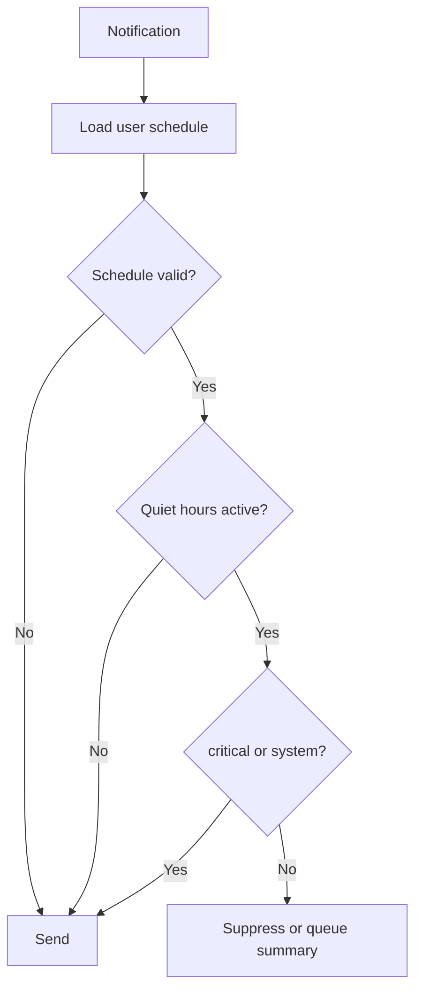

# Operational Improvements Specification

## 1. Назначение

Документ описывает набор продовых улучшений для Telegram HA Bot, связанных с
эксплуатацией камер, архива записей, диагностики и уведомлений.

Цели:

- автоматически обнаруживать деградацию камер и уведомлять администраторов;
- защищать важные записи от автоматической очистки;
- упростить навигацию по большому архиву записей;
- добавить pre-roll 15 секунд по умолчанию к событийным записям камер;
- дать администратору runtime dashboard для диагностики сервиса;
- добавить тихие часы и расписание уведомлений.

## 2. Контекст

Сервис уже умеет:

- синхронизировать устройства и комнаты Home Assistant;
- слушать события Home Assistant;
- отправлять уведомления пользователям с учетом прав;
- работать с камерами: snapshot, clip, archive;
- записывать видео по событиям HA;
- хранить архив записей на диске и метаданные в SQLite;
- показывать camera health screen;
- выполнять maintenance cleanup.

Новые функции должны расширять существующую архитектуру без внешнего HTTPS
сервера и без Telegram Mini App.

## 3. Термины

| Термин | Описание |
|---|---|
| Camera degradation | Состояние камеры после нескольких подряд ошибок snapshot, clip или recording |
| Recovery | Возврат камеры из degraded после успешной операции |
| Pinned recording | Архивная запись, защищенная от retention/quota cleanup |
| Pre-roll | Скользящее окно видеопотока перед событием, добавляемое в начало событийной записи |
| Quiet hours | Интервал времени, когда обычные уведомления подавляются |
| Runtime dashboard | Админский экран с текущим состоянием сервиса |

## 4. Общая архитектура



## 5. Feature 1: оповещения о деградации камер

### 5.1. Цель

Автоматически уведомлять администраторов, если камера несколько раз подряд не
дала snapshot, clip, recording или health check. После восстановления отправлять
отдельное уведомление.

### 5.2. Модель данных

Расширить таблицу `camera_health`.

| Поле | Тип | Default | Описание |
|---|---|---:|---|
| `consecutive_failures` | INTEGER | `0` | Количество ошибок подряд |
| `consecutive_successes` | INTEGER | `0` | Количество успехов подряд после degraded |
| `health_state` | TEXT | `'unknown'` | `unknown`, `healthy`, `degraded` |
| `last_state_changed_at` | TEXT NULL | NULL | Когда состояние камеры изменилось |
| `degraded_at` | TEXT NULL | NULL | Когда камера стала degraded |
| `recovered_at` | TEXT NULL | NULL | Когда камера восстановилась |
| `degradation_alert_sent_at` | TEXT NULL | NULL | Когда отправлен degradation alert |
| `recovery_alert_sent_at` | TEXT NULL | NULL | Когда отправлен recovery alert |
| `last_failure_kind` | TEXT NULL | NULL | `snapshot`, `clip`, `recording`, `health_check` |

### 5.3. Настройки

Добавить в `app_settings`.

| Key | Default | Описание |
|---|---:|---|
| `camera_health_check_enabled` | `1` | Включен ли фоновый health-check камер |
| `camera_health_check_interval_s` | `10` | Период фоновой проверки камер |
| `camera_health_failure_threshold` | `3` | Сколько ошибок подряд нужно для degraded |
| `camera_health_recovery_successes` | `1` | Сколько успехов подряд нужно для recovery |
| `camera_health_alert_cooldown_s` | `3600` | Минимальный интервал повторного degraded alert |

Фоновая проверка:

- worker запускается раз в `camera_health_check_interval_s`;
- проверяются enabled-камеры;
- если у камеры активен `PreRollBufferManager`, проверка читает состояние
  владельца потока и последний доступный кадр, не открывая второе RTSP-соединение;
- если pre-roll owner не активен, проверка использует snapshot flow камеры;
- alert отправляется только при смене `health_state`: `healthy -> degraded`
  или `degraded -> healthy`;
- первичный переход `unknown -> healthy` не отправляет alert, а
  `unknown -> degraded` отправляет degraded alert после достижения порога
  ошибок.

### 5.4. Алгоритм



### 5.5. Получатели alerts

- Degraded/recovery alerts отправляются всем администраторам.
- Список администраторов вычисляется в момент отправки alert.
- `root_user` всегда входит в список получателей.
- Если в системе есть отдельная роль администратора, в список также входят
  пользователи с этой ролью.
- Дубликаты получателей удаляются перед отправкой.
- Ошибка отправки одному администратору не должна блокировать отправку остальным.
- Результат рассылки логируется по каждому получателю.

### 5.6. Telegram уведомления

Degraded:

```text
⚠️ Камера недоступна
Камера: <name>
Ошибка: <last_error>
Тип: <snapshot|clip|recording|health_check>
Ошибок подряд: <n>
```

Recovery:

```text
✅ Камера восстановилась
Камера: <name>
Последняя успешная проверка: <datetime>
```

### 5.7. Критерии приемки

- После `camera_health_failure_threshold` подряд ошибок все администраторы получают
  degraded alert при переходе `healthy -> degraded` или `unknown -> degraded`.
- Повторные ошибки degraded-камеры не создают новые alerts до recovery.
- После успешной операции или фоновой проверки degraded-камеры все администраторы
  получают recovery alert при переходе `degraded -> healthy`.
- Ошибка доставки одному администратору не отменяет доставку другим
  администраторам.
- Фоновая проверка выполняется раз в 10 секунд при настройках по умолчанию.
- Статус одной камеры не влияет на другую.
- Health screen показывает degraded/recovered состояние.

## 6. Feature 2: закрепление важных записей

### 6.1. Цель

Дать администратору возможность защитить важные записи от retention/quota
cleanup.

### 6.2. Модель данных

Расширить `camera_recording_sessions`.

| Поле | Тип | Default | Описание |
|---|---|---:|---|
| `pinned_at` | TEXT NULL | NULL | Когда запись закреплена |
| `pinned_by` | INTEGER NULL | NULL | Telegram user id администратора |
| `pin_note` | TEXT NULL | NULL | Опциональная заметка |

### 6.3. UI

В экране записи добавить кнопку:

- `📌 Закрепить`, если запись не закреплена;
- `📌 Открепить`, если запись закреплена.

В списке архива закрепленные записи помечаются `📌`.

### 6.4. Правила cleanup

- Retention cleanup не удаляет pinned-записи.
- Quota cleanup не удаляет pinned-записи.
- Так как файлы хранятся в `camera_recording_segments`, все cleanup-запросы
  должны проверять закрепление через session:
  `camera_recording_segments.session_id -> camera_recording_sessions.id`.
- `find_expired_sessions` должен исключать sessions с `pinned_at IS NOT NULL`.
- `list_deletable_sessions_for_quota` должен возвращать только sessions с
  `pinned_at IS NULL`.
- `sum_ready_size_bytes` продолжает считать общий размер архива, включая pinned,
  чтобы dashboard мог показать превышение quota из-за защищенных записей.
- Ручное удаление администратором разрешено, но требует подтверждения.
- Если quota превышена, но все кандидаты pinned, maintenance пишет warning и
  dashboard показывает проблему.

### 6.5. Критерии приемки

- Закрепленная запись остается после `expires_at`.
- Закрепленная запись не удаляется при превышении quota.
- Ни один segment закрепленной session не удаляется retention/quota cleanup.
- Открепленная запись снова участвует в cleanup.
- Ручное удаление удаляет запись и sidecar-файлы.

## 7. Feature 3: фильтры архива

### 7.1. Цель

Сделать архив удобным при большом количестве записей.

### 7.2. Фильтры

| Filter | Описание |
|---|---|
| `all` | Все записи |
| `today` | Записи за текущий день по timezone сервиса |
| `week` | Последние 7 дней |
| `ready` | Только готовые |
| `failed` | Failed и partial |
| `pinned` | Только закрепленные |
| `rule:<id>` | Записи основного или продлившего правила |

`partial` не является отдельным статусом в БД. Это вычисляемое состояние:
`camera_recording_sessions.status = 'failed'` и у session есть хотя бы один
`camera_recording_segments.status = 'ready'`.

Фильтр `rule:<id>` должен показывать запись, если:

- `camera_recording_sessions.rule_id = <id>`;
- или `<id>` входит в JSON-массив `extended_by_rule_ids`.

### 7.3. UI

В экране архива добавить строку фильтров:

```text
Все · Сегодня · 7 дней · Готовые · Ошибки · 📌
```

Если правил много, фильтр по правилу открывается отдельным экраном выбора
правила.

### 7.4. DB/API

Добавить функцию:

```rust
list_camera_sessions_filtered(camera_id, filter, limit, offset, pool)
```

Функция должна использовать структурный разбор `extended_by_rule_ids` как JSON,
а не поиск подстроки в TEXT.

Сортировка:

1. pinned сверху;
2. новые сверху;
3. failed не скрываются, если фильтр их допускает.

### 7.5. Критерии приемки

- Фильтр не показывает записи чужих камер.
- `today` работает по локальному времени сервиса.
- `failed` показывает failed-only и partial-записи.
- `rule:<id>` показывает session в архиве каждого правила, которое ее создало
  или продлило.
- Пагинация сохраняет выбранный фильтр.
- Пустой фильтр показывает empty state.

## 8. Feature 4: pre-roll для событийных записей

### 8.1. Цель

Добавить 15 секунд видео до события по умолчанию, чтобы запись показывала
причину срабатывания, а не только последствия.

Pre-roll должен работать как постоянный скользящий буфер камеры. В момент
триггера система фиксирует время события, продолжает захват до конца обычного
окна записи и после этого формирует обычные архивные сегменты из pre-roll
части и видео после события.

### 8.2. Модель данных

Расширить `camera_recording_rules`.

| Поле | Тип | Default | Описание |
|---|---|---:|---|
| `pre_roll_enabled` | INTEGER | `0` | Включен ли pre-roll |
| `pre_roll_seconds` | INTEGER | `15` | Длительность pre-roll |

Ограничение: `pre_roll_seconds` должен быть в диапазоне `0..=15`.
Значение `0` эквивалентно выключенному pre-roll для правила.

Расширить `camera_recording_sessions`.

| Поле | Тип | Default | Описание |
|---|---|---:|---|
| `pre_roll_from` | TEXT NULL | NULL | Фактическое начало окна записи |
| `pre_roll_seconds` | INTEGER | `0` | Сколько секунд pre-roll применено к session |
| `pre_roll_partial` | INTEGER | `0` | Буфер был прогрет не полностью |
| `pre_roll_warning` | TEXT NULL | NULL | Техническое предупреждение по pre-roll |

Добавить настройки в `app_settings`.

| Key | Default | Описание |
|---|---:|---|
| `camera_pre_roll_enabled` | `0` | Глобальный флаг функции |
| `camera_pre_roll_max_buffer_bytes_per_camera` | `67108864` | Лимит RAM ring buffer на камеру |
| `camera_pre_roll_max_total_buffer_bytes` | `1073741824` | Общий лимит RAM ring buffers |

Лимиты задают верхнюю границу, а не предварительное резервирование памяти.
Pre-roll должен потреблять память только для камер с активным owner'ом и хранить
только encoded chunks, а не распакованные full frames. Ориентировочный расход
на камеру:

```text
memory_bytes ~= bitrate_bps * (pre_roll_seconds + safety_margin) / 8 + overhead
```

Для 15 секунд pre-roll и `safety_margin = 2` камера с bitrate 4 Mbps требует
примерно 9 MiB плюс небольшой overhead. Лимит 64 MiB на камеру оставляет запас
для камер с высоким bitrate, а общий лимит 1 GiB ограничивает потребление
процесса в проде.

Миграция:

- существующие правила получают `pre_roll_enabled = 0`, чтобы не увеличить
  нагрузку на камеры без явного решения администратора;
- при включении pre-roll в UI поле `pre_roll_seconds` по умолчанию показывает
  `15`;
- новые правила записи могут предлагать включенный pre-roll только если
  включен глобальный флаг функции.

### 8.3. Архитектура



### 8.4. Алгоритм

1. `PreRollBufferManager` отслеживает активные правила записи.
2. Для камеры запускается не больше одного `Camera stream owner`.
3. Owner постоянно читает поток камеры и держит в оперативной памяти rolling
   buffer из encoded chunks с timestamps. Буфер не хранит сырое видео в full
   frames, кроме отдельного latest frame для snapshot/current frame UI.
4. Для каждой камеры хранится минимум `max(pre_roll_seconds) + safety_margin`
   истории. Для MVP `safety_margin = 2` секунды.
   Если memory cap достигается раньше, owner хранит максимально доступное окно
   и помечает запись как partial pre-roll.
5. При событии `Recording matcher` создает или продлевает session и фиксирует:
   `triggered_at`, `pre_roll_from = triggered_at - pre_roll_seconds`,
   `record_until`.
6. Recording writer получает snapshot RAM buffer для `[pre_roll_from,
   triggered_at]`, затем продолжает получать live chunks от owner до
   `record_until`.
7. Writer пишет обычные файлы сегментов и metadata в `camera_recording_segments`
   по текущей модели архива. Первый segment начинается с `pre_roll_from`;
   следующие segments нарезаются по `max_segment_seconds`, как и раньше.
8. Пока session активна, owner продолжает обновлять скользящее окно.
   Повторный триггер той же session продлевает `record_until`, но не сдвигает
   `pre_roll_from` вперед.
9. Когда segment готов, для него создаются preview/thumbnail и обновляется
   metadata в SQLite.
10. Если буфер прогрет частично, итоговая запись получает доступную часть
   pre-roll и warning в metadata/log.
11. Если owner камеры недоступен, session должна перейти на текущий обычный
   механизм записи без pre-roll.
12. Если RAM-лимит камеры или общий RAM-лимит превышен, owner должен остановить
   pre-roll для этой камеры, записать warning и отдать управление обычному
   recording flow.

### 8.5. Взаимодействие с ручными действиями камеры

- Pre-roll owner является долгоживущим владельцем потока камеры и не должен занимать
  слот одноразовых `snapshot`/`clip` jobs.
- Если у камеры активен pre-roll owner, кнопка фото в меню камеры получает
  latest frame из owner/cache и не открывает второе RTSP-соединение.
- Если owner не активен или latest frame недоступен, кнопка фото использует
  существующий snapshot flow.
- Если у камеры активен pre-roll owner, ручная запись видео запрашивает у owner
  отдельный clip writer. Он пишет отдельный файл из RAM buffer и live chunks,
  не удаляя и не блокируя chunks событийной записи.
- Если owner не активен, ручная запись видео использует существующий clip flow.
- Если камера уже имеет активный pre-roll buffer, ручные snapshot/clip операции
  не должны создавать второго владельца RTSP-потока.
- Остановка или ошибка ручного snapshot/clip не должна сбрасывать pre-roll
  buffer камеры.
- Экран текущего кадра камеры использует latest frame от owner, если owner
  активен, иначе остается на snapshot cache.

### 8.6. Sequence diagram



### 8.7. Критерии приемки

- При включении pre-roll UI предлагает `15` секунд по умолчанию.
- При `pre_roll_seconds = 15` итоговая запись содержит примерно 15 секунд до
  первого события session.
- Если buffer прогрет только 7 секунд, итоговая запись содержит доступные 7
  секунд и сохраняет warning.
- Повторный триггер активной session продлевает запись после события, но не
  удаляет pre-roll первого триггера.
- Запись с pre-roll хранится в обычных `camera_recording_segments`.
- Если pre-roll недоступен, обычная запись все равно создается.
- Отключение всех pre-roll правил останавливает owner камеры.
- Pre-roll owner не занимает слот одноразовых snapshot/clip jobs.
- Ручное фото из меню камеры получает кадр из owner/cache при активном pre-roll.
- Ручная запись видео из меню камеры создает отдельный файл и не повреждает
  RAM buffer событийной записи.
- Активный pre-roll не открывает второе RTSP-соединение для ручных действий.
- При настройках по умолчанию общий объем RAM buffers pre-roll не превышает
  1 GiB, а один owner камеры не превышает 64 MiB.
- Камеры без активного pre-roll owner не выделяют RAM ring buffer.
- После рестарта сервиса RAM buffer пустой; первые записи получают partial
  pre-roll или fallback на обычную запись.

## 9. Feature 5: runtime dashboard

### 9.1. Цель

Дать администратору быстрый экран диагностики без чтения логов.

### 9.2. Экран

Добавить в админку пункт `Runtime`.

Показывать:

| Блок | Метрики |
|---|---|
| Home Assistant | last sync, last sync error, websocket status |
| Camera jobs | active live jobs, active local media jobs, active pre-roll owners, pre-roll RAM bytes, timed out jobs |
| Recording | active sessions, queued jobs, failed last hour |
| Storage | archive size, quota, pinned size, tmp files count/size |
| Maintenance | last tick, last cleanup, last error |
| Telegram UI | active sessions, blocked refresh count |

### 9.3. Источники данных

- Расширить `RuntimeStatus`.
- Добавить counters в `core::cameras` и `PreRollBufferManager`.
- Storage-агрегаты считать в maintenance и кешировать.
- Ошибки HA sync и maintenance сохранять в runtime status.

### 9.4. Критерии приемки

- Экран открывается без тяжелого сканирования диска.
- Значения обновляются maintenance worker-ом.
- При отсутствии данных показывается `нет данных`.
- Последние ошибки HA/camera/maintenance видны в одном месте.

## 10. Feature 6: тихие часы и расписание уведомлений

### 10.1. Цель

Уменьшить шум уведомлений ночью и дать пользователям персональный контроль.

### 10.2. Модель данных

Добавить таблицу `user_notification_schedule`.

| Поле | Тип | Описание |
|---|---|---|
| `user_id` | INTEGER PRIMARY KEY | Telegram user id |
| `quiet_enabled` | INTEGER | Включены ли тихие часы |
| `quiet_from` | TEXT | Например `23:00` |
| `quiet_to` | TEXT | Например `07:00` |
| `timezone` | TEXT | Например `Europe/Moscow` |
| `critical_only` | INTEGER | В тихие часы пропускать только critical |
| `updated_at` | TEXT | Время обновления |

### 10.3. Валидация

- `quiet_from` и `quiet_to` должны быть в формате `HH:MM`.
- Допустимый диапазон времени: `00:00..23:59`.
- Если `quiet_from < quiet_to`, интервал считается внутри одного дня.
- Если `quiet_from > quiet_to`, интервал считается переходящим через полночь.
- Если `quiet_from = quiet_to`, quiet hours считаются выключенными.
- `timezone` должен быть валидным IANA timezone. Если пользователь не задал
  timezone, используется timezone сервиса.
- Невалидные настройки не сохраняются через UI.
- Если в БД уже лежит невалидная настройка, система игнорирует quiet hours для
  пользователя, пишет warning и не блокирует отправку critical/system.

### 10.4. Типы уведомлений

| Тип | Поведение |
|---|---|
| `normal` | Подавляется в quiet hours |
| `critical` | Доставляется всегда |
| `system` | Доставляется админу всегда |
| `summary` | Может копиться и отправляться после quiet hours |

Quiet hours применяются только к доставке уведомлений. Они не должны отменять
Home Assistant sync, выполнение действий, запись видео, health-check, activity
log и runtime metrics.

### 10.5. Алгоритм



### 10.6. Критерии приемки

- Пользователь может включить и выключить quiet hours.
- В quiet hours обычные уведомления не приходят.
- Critical/system уведомления приходят всегда.
- Интервал через полночь работает корректно.
- Невалидный `HH:MM` или timezone не сохраняется через UI.
- Quiet hours не блокируют выполнение действий, recording rules и запись в
  activity log.
- Настройки одного пользователя не влияют на другого.

## 11. Этапы реализации

| Этап | Состав | Результат |
|---|---|---|
| 1 | Camera degradation alerts | Админ получает degraded/recovery alerts |
| 2 | Runtime dashboard | Админ видит состояние HA, камер, storage и jobs |
| 3 | Pinned recordings | Важные записи защищены от cleanup |
| 4 | Archive filters | Архив можно фильтровать по дате, статусу и pinned |
| 5 | Quiet hours | Уведомления учитывают персональное расписание |
| 6 | Pre-roll | Событийные записи могут содержать 15 секунд видео до события |

## 12. Нефункциональные требования

| Категория | Требование |
|---|---|
| Производительность | Открытие Telegram-экранов не должно запускать тяжелые ffmpeg операции синхронно |
| Надежность | Ошибка одной камеры не должна блокировать другие камеры |
| Ресурсы камер | Долгоживущие pre-roll owners должны учитываться отдельно от одноразовых snapshot/clip jobs |
| Память | RAM ring buffers pre-roll должны хранить encoded chunks, не резервировать память заранее и по умолчанию не превышать 64 MiB на камеру и 1 GiB на процесс |
| Хранилище | Cleanup не должен удалять pinned-записи и активные tmp-файлы |
| Логирование | Все degraded/recovery события должны писаться в activity log |
| Безопасность | Пользователь видит только камеры и записи, доступные по текущим правам |

## 13. Допущения и открытые вопросы

| ID | Вопрос | Рекомендация |
|---|---|---|
| Q-001 | Нужна ли заметка к pinned записи? | Поле заложить, UI можно сделать позже |
| Q-002 | Нужен ли summary после quiet hours? | MVP: подавлять без summary, затем добавить настройку |
