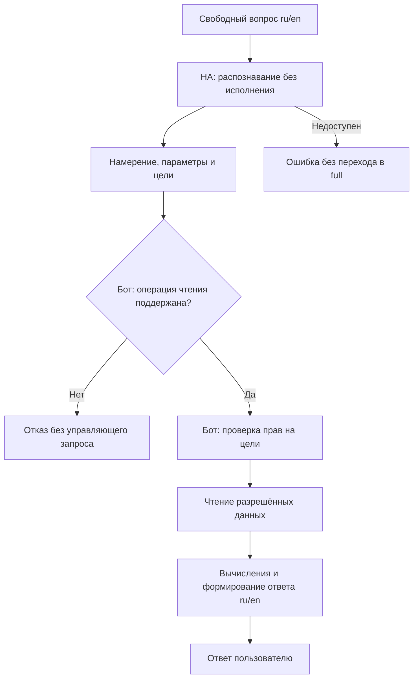

# План устранения замечаний ревью

Дата: 2026-09-27. Версия: 1.3.
Статус: изменения всех шести этапов внесены в рабочее дерево. Локальные проверки
пройдены; интеграционная приёмка и проверка полноты корпуса FIX-03 остаются
условиями выпуска. Фактические результаты и ограничения перечислены в
[IMPLEMENTATION_STATUS.md](IMPLEMENTATION_STATUS.md).

Уточнение при реализации: пользователь подтвердил первый запуск, без ранее
использовавшегося корпуса вопросов. Вместо сравнения с прежними ответами проводится
приёмка начального корпуса ru/en на настроенном HA; остальные требования сохраняются.

Цель — устранить шесть замечаний к текущему рабочему дереву Telegram HA Bot.
План включает изменения, регрессионные проверки и переход существующей установки.
P1 означает высокий приоритет, P2 — средний. Все шесть пунктов входят в результат.

Обязательное условие — сохранить реализованные пользовательские возможности.
Для FIX-03 выбран вариант «HA распознаёт, бот читает и отвечает» без отдельного
агента и custom component. Устранение обхода прав не означает сохранение
возможности выполнять запрещённые действия.

## 1. Порядок работ

| Этап | ID замечания | Приоритет | Результат |
|---|---|---|---|
| 1 | FIX-01 | P1 | Запись длинного Unicode-текста в журнал не вызывает panic |
| 2 | FIX-02 | P1 | Новые комнаты закрыты для `guest` и `child` по умолчанию |
| 3 | FIX-03 | P1 | Свободные вопросы к HA сохранены; действия запрещены до исполнения |
| 4 | FIX-04 | P1 | Видео хранится в постоянном томе Docker |
| 5 | FIX-05 | P2 | Повторное событие не сокращает активную запись |
| 6 | FIX-06 | P2 | Изменение числа камер обновляет лимиты всех pre-roll буферов |
| 7 | CHECK-01 | — | Общие проверки и проверка обновления существующей установки |

FIX-03 использует правила доступа из FIX-02. Остальные исправления технически
независимы; порядок выше позволяет сначала закрыть падение процесса и обходы прав.
Перенос существующего архива из FIX-04 выполняется **до первого пересоздания
контейнера**, даже если остальные изменения ещё не готовы.

Оформлять каждое исправление отдельным коммитом с соответствующими тестами.
Текущие незакоммиченные изменения учитывать как исходную версию для исправлений.

### Сохранение функциональности

Перед изменением соответствующего модуля зафиксировать его действующие сценарии
и проверить их после исправления. Новые тесты добавлять для изменяемого поведения;
остальные возможности проверять существующими тестами и проверкой на стенде.

| Возможность | Требование совместимости |
|---|---|
| Комнаты, устройства, графики, настройки | Сохраняются интерфейсы, команды и доступ, явно выданный администратором |
| Профили, индивидуальные разрешения, подписки | Сохраняются записи и приоритеты правил; исправляется доступ по умолчанию для ограниченных ролей |
| `local_parser`, `ha_conversation_readonly`, `ha_conversation_full` | Сохраняются три режима, значения конфигурации и персональный выбор |
| Свободные вопросы к HA | Сохраняются поддержанные текущим агентом безопасные вопросы и формулировки на ru/en |
| Голос, текст, подтверждения опасных действий | Сохраняются способы ввода, STT, подтверждения и их TTL |
| Камеры и архив | Сохраняются снимок, ролик, отправка сегментов, фильтры архива и закрепление записей |
| Правила и группы записи | Сохраняются условия, расписания, cooldown, retention и ручная остановка |
| Pre-roll | Сохраняются настройки длительности и работа всех включённых камер при достаточных ресурсах; при нехватке памяти используется существующий partial/fallback |
| Группы действий и расписания | Сохраняются выполнение, выбор устройств и проверки доступа |
| Уведомления, тихие часы, health, журнал | Сохраняются персональные настройки и критические уведомления |
| UI, языки, фон, восстановление сессий | Сохраняются ru/en, обновление экранов и восстановление после перезапуска |
| Хранение и обновление | Сохраняются БД, архив, явные пути и совместимость существующего `options.json` |

Успешная компиляция сама по себе не подтверждает выполнение этой таблицы.

## 2. FIX-01: безопасное ограничение текста журнала

**Файлы:** `src/db/mod.rs`, `src/db/activity_log.rs`.

**Изменения:**

1. Сохранить существующий предел в 500 байт и замену переносов строк пробелами.
2. Перед обрезанием найти ближайшую границу UTF-8 символа, не превышающую лимит.
3. Проверить путь записи через `activity_log::log`, который использует эту функцию
   для обычных сообщений и ошибок.

**Приёмка FIX-01:**

- ASCII-текст длиной 499, 500 и 501 байт обрабатывается без ошибки.
- Кириллица, emoji и смешанный текст с символом на границе 500 байт не вызывают panic.
- Воспроизводящий пример `"x" + "я".repeat(300)` успешно сохраняется в журнал.
- Результат остаётся корректной UTF-8 строкой длиной не более 500 байт.

## 3. FIX-02: права по умолчанию зависят от роли

**Файлы:** `src/db/access.rs`, `src/db/rooms.rs`, `src/db/devices.rs`,
`src/db/subscriptions.rs`; потребители прав в `src/core/commands.rs`,
`src/db/cameras.rs` и `src/bot/router.rs`.

**Предлагаемая политика:**

| Профиль | Нет явного правила комнаты или устройства |
|---|---|
| `root_user` | Применяется существующая политика root |
| `user` | Просмотр и управление разрешены |
| Существующая запись роли `admin`, если она есть в БД | Сохраняется текущее поведение этой роли; она не приравнивается к `root_user` |
| `child`, `guest` | Просмотр и управление запрещены |
| Нет `user_profiles`, но пользователь в белом списке | Сохраняется поведение `user` для совместимости |
| Неизвестное значение роли | Доступ запрещён, причина записывается в журнал |

**Изменения:**

1. Определить общую политику вычисления прав: явное правило устройства,
   затем явное правило комнаты, затем значение по умолчанию для роли.
   Сохранить ограничения для архивных устройств и глобально скрытых комнат.
2. Заменить безусловное разрешение в `COALESCE(..., 1)` во всех запросах,
   вычисляющих просмотр и управление. Проверить списки, итоговые проверки действий,
   сводку прав, выбор получателей уведомлений и создание переопределений прав.
3. При переключении уведомлений сохранять эффективные права просмотра и управления:
   включение уведомлений не должно создавать доступ к скрытому устройству.
4. Проверять политику при каждом обращении; синхронизация новой комнаты не должна
   требовать заполнения запрещающих строк для каждого гостя.
5. Явные разрешения администратора сохранить. Существующие таблицы подходят для
   исправления; новая миграция для изменения значений по умолчанию не требуется.

**Приёмка FIX-02:**

- Создать `guest` и `child`, затем синхронизировать новую комнату с устройством.
  Комната, устройство и камера в ней недоступны в списках и по прямому callback.
- Текстовая и голосовая команды для этого устройства отклоняются; HA service
  не вызывается, уведомления о его состоянии не отправляются этому пользователю.
- Явное разрешение комнаты открывает доступ; режим просмотра позволяет чтение,
  но запрещает управление. Проверяются также индивидуальные правила устройства.
- Переключение подписки или уведомлений не меняет доступ к управлению.
- Обычный пользователь и root сохраняют предусмотренные для них возможности.
- Проверки выполняются на SQLite со схемой из реальных миграций, включая вариант
  существующего пользователя без строки `user_profiles`.

## 4. FIX-03: безопасный readonly с сохранением свободных вопросов

**Выбранная архитектура:** стандартный HA-агент только распознаёт исходную фразу.
Бот принимает структурированный результат, проверяет операцию и права пользователя,
читает разрешённые данные и формирует ответ. Отдельный HA-агент, LLM и установка
компонента в HA не входят в это решение.

**Файлы и ответственность:**

| Файл | Изменение |
|---|---|
| `src/ha/intent_recognition.rs` — новый | WebSocket-распознавание, типизированный ответ и ошибки совместимости |
| `src/core/readonly.rs` — новый | Допустимые операции чтения, проверка целей, вычисление и формирование ответа |
| `src/ha/client.rs`, `src/ha/models.rs` | Получение состояния и нужных атрибутов через интерфейс чтения |
| `src/ha/mod.rs`, `src/core/mod.rs` | Подключение новых модулей |
| `src/core/commands.rs` | Направление режима readonly в новый обработчик |
| `src/models.rs`, `src/main.rs` | Передача зависимостей и диагностического состояния распознавания |
| `src/i18n.rs`, `README.md` | Ответы ru/en, диагностика совместимости и описание режима |

### Контракт распознавания

В исходниках HA 2026.9.0 есть WebSocket-команда
`conversation/agent/homeassistant/debug`. Она вызывает `async_debug_recognize`
стандартного агента и возвращает распознанное намерение без его исполнения.
Это диагностический интерфейс: поддержку установленной версией и формат ответа
нужно проверить, не предполагая стабильность между всеми версиями HA.
Источники: [обработчик WebSocket](https://github.com/home-assistant/core/blob/2026.9.0/homeassistant/components/conversation/http.py),
[реализация распознавания](https://github.com/home-assistant/core/blob/2026.9.0/homeassistant/components/conversation/default_agent.py).

После обычной авторизации HA WebSocket бот отправляет один вопрос:

```json
{
  "id": 1,
  "type": "conversation/agent/homeassistant/debug",
  "sentences": ["какая температура в спальне"],
  "language": "ru"
}
```

Проверять тип ответа, совпадение `id`, `success` и ровно один элемент
`result.results`. Для успешного совпадения разбирать `match`, `intent.name`,
типизированные `details`/`slots`, `targets` и необязательный `source`.
`null`, `match = false`, отсутствие обязательных данных или неизвестный формат
дают отдельную ошибку без отправки фразы на исполнение.

Поле `targets` содержит ID сущностей и признак `matched`. Этот признак отражает
результат распознавания и фильтрацию по состоянию, а не права Telegram-пользователя.
Права всегда вычисляет бот. Ответы с `source = trigger` не исполняются.
Пользовательское имя intent не считается доказательством безопасности:
разрешены только локально реализованные операции чтения, проверяющие свои параметры.

Транспорт использует существующие HA URL и токен, правильное преобразование
схемы URL, ограничение времени подключения/авторизации и общий deadline из
`voice_stt_timeout_s`. Секреты и необработанный ответ с чужими сущностями
не попадают в журнал. В режиме readonly REST `/api/conversation/process`
и WebSocket `conversation/process` не вызываются.

### FIX-03A: транспорт и проверка совместимости

1. Реализовать клиент распознавания и тестовый WebSocket-сервер с успешными,
   ошибочными, неполными и несовместимыми ответами.
2. Зафиксировать версию установленного HA и проверить наличие команды отдельным
   диагностическим запросом. Ошибку совместимости показывать явно; остальные
   режимы бота и STT продолжают работать.
3. Зафиксировать корпус ранее работающих безопасных вопросов и ответы на стенде:
   одиночное состояние, температура и единицы измерения, открытые окна,
   включённый свет, количество и списки устройств, групповые вопросы, варианты ru/en.
   Добавить используемые на установке вопросы вне этого начального списка.
4. Для каждого примера записать распознанный intent, параметры и требуемую
   операцию чтения. Проверять семантику ответа, а не дословное совпадение текста.
5. Сравнить покрытие с прежним путём. Диагностическое распознавание не содержит
   всех дополнительных путей обработки обычного Conversation. Обнаруженные
   пропуски фиксировать как регрессии; устранять их в рамках выбранной архитектуры
   до включения нового пути. Переход к отдельному агенту не подразумевается.

**Результат FIX-03A:** работающий транспорт, подтверждённая совместимость версии HA,
зафиксированный корпус и таблица intent → обработчик чтения. Это первый этап
реализации выбранного решения, а не повторный выбор архитектуры.

### FIX-03B: проверка доступа, чтение и ответы в боте

1. Создать типизированные операции: чтение состояния/атрибута, список,
   количество и проверки «есть ли»/«все ли». Дополнить их операциями из корпуса
   FIX-03A. Ограничивать операции, а не пользовательские формулировки вопросов.
2. Получать пользователя из проверенного Telegram-контекста, а разрешения —
   из FIX-02. Сопоставлять ID целей с устройствами и проверять просмотр до
   отдельного чтения состояний. Отсутствующая в БД цель не даёт обычному
   пользователю автоматического доступа; для root действует его политика.
3. Для групповых вопросов сначала отфильтровать все цели по правам, затем считать
   результаты. Учитывать разрешённые совпавшие и несовпавшие цели для «все ли».
   Уточнять в ответе область «доступные вам устройства», если она ограничена.
   Явно указанная недоступная цель даёт ответ без раскрытия её состояния и имени.
4. Читать актуальное состояние и необходимые атрибуты. При необходимости ввести
   отдельную модель состояния с единицами измерения: текущего `Entity` недостаточно
   для всех вопросов. Не подставлять ноль вместо `unknown`/`unavailable`.
   После ожидания сетевого ответа повторно проверить права перед выдачей данных.
5. Формировать ответы ru/en в боте, сохраняя имена/alias, смысл атрибутов и единицы.
   Метаданные `matched` не выдавать за актуальное состояние: проверять предикат
   по заново прочитанным данным. Не выполнять код, шаблоны или инструкции из слотов.
6. Предоставить обработчику узкий интерфейс распознавания и чтения без методов
   управления. Полученный intent никогда не передаётся произвольному исполнителю
   HA; каждая поддержанная операция имеет собственный обработчик в Rust.
7. Сохранить значение `ha_conversation_readonly`, персональный выбор, STT,
   команды камер и маршруты full/local. Новые обязательные настройки и миграция
   существующего выбора voice engine не требуются.
8. При неизвестной операции, ошибке или несовместимости возвращать явный результат
   без перехода к обычному Conversation API. Удалить фильтр запрещённых слов
   как механизм обеспечения безопасности readonly.

HA остаётся доверенной системой и использует свой существующий каталог сущностей
при распознавании. Выбранный endpoint не принимает ACL Telegram; бот обеспечивает
изоляцию данных в своих чтениях, вычислениях, ответах и журналах. Не обещать
фильтрацию внутреннего каталога HA по каждому Telegram-пользователю.



**Приёмка FIX-03:**

- Весь корпус FIX-03A сохраняет смысл ответов и языки без перехода на
  фиксированные команды. Проверены единицы, списки, количества, «есть ли»/«все ли»
  и недоступные состояния; дополнительный агент или компонент HA не установлен.
- Чтение разрешённого устройства работает при `can_control = false`.
- Скрытые сущности исключаются до чтения ботом, вычисления статистики и выдачи
  ответа. Сырые результаты HA не раскрываются пользователю и в его журнале.
- Фразы `покажи статус и активируй сцену ночь`,
  `show status and activate the night scene`, команды с переносами строк и
  смешением языков не вызывают управляющих операций.
- Транспортные тесты фиксируют отсутствие вызовов Conversation process,
  управляющих сервисов и intent-исполнителя. Стенд HA подтверждает отсутствие
  побочных действий при распознавании, включая фразы, совпавшие с sentence trigger.
- Проверены таймаут, ошибка авторизации, неизвестная команда WebSocket,
  несовместимый JSON, `null`, `match = false`, неизвестный intent и отзыв прав
  во время запроса. Ни один случай не приводит к вызову управляющего агента.
- После обновления действуют прежние настройки full/local, команды камер и STT.

## 5. FIX-04: постоянное хранение архива в Docker

**Файлы:** `src/options.rs`, при необходимости `src/config.rs` и `src/main.rs`,
`Dockerfile`, `README.md`.

**Изменения:**

1. Добавить выбор пути с явным порядком: поле `camera_recording_storage_root`
   в JSON → переменная `CAMERA_RECORDING_STORAGE_ROOT` → локальное значение
   `data/recordings`. Явную конфигурацию пользователя не переопределять неявно.
2. В Docker задать `CAMERA_RECORDING_STORAGE_ROOT=/data/recordings`.
   Для Docker-примера с явно заполненным JSON также указать `/data/recordings`.
3. При запуске показывать в журнале итоговый абсолютный путь к архиву и проверять
   возможность создать каталог и записать файл до запуска записи с камер.
   Недоступный архив переводит подсистему записи в диагностируемое состояние
   ошибки; управление устройствами, Telegram UI и остальные независимые функции
   продолжают работать. Не вводить новый глобальный отказ запуска бота.
4. Сохранить относительные пути файлов внутри БД, чтобы перенос корня архива
   не требовал массового обновления записей.
5. Добавить в README процедуру переноса существующего архива.

**Переход существующей установки:**

1. Определить текущий путь и проверить, находится ли архив в `/app/data/recordings`.
2. Приостановить создание и автоматическое удаление записей; дождаться завершения
   активных записей. Сделать согласованную резервную копию SQLite и архива.
3. Скопировать архив с сохранением относительной структуры в смонтированный `/data`.
   При запуске с `--rm` завершить копирование **до остановки старого контейнера**.
4. Задать `/data/recordings` в существующем `options.json`, если там указан старый
   относительный путь. Сверить число и размеры файлов, открыть несколько записей.
5. Пересоздать контейнер, проверить доступность старых записей и запись нового видео.
   Копию исходного архива хранить до завершения проверки.

**Приёмка FIX-04:**

- Проверена матрица выбора пути: минимальный JSON, явный относительный и абсолютный
  путь, переменная окружения, отсутствие переменной и недоступный каталог.
- На тестовом Docker-стенде запись воспроизводится после удаления и создания нового
  контейнера с тем же томом. Проверяется также новая запись после пересоздания.
- Перенесённый архив открывается по существующим строкам БД.
- При ошибке доступа к хранилищу бот продолжает обрабатывать обычные команды,
  а ошибка записи видна в диагностике.

## 6. FIX-05: монотонное продление записи

**Файлы:** `src/db/camera_recording_sessions.rs`, тесты записи
в `src/core/camera_recording.rs` при необходимости.

**Изменения:**

1. В текущей транзакции вычислять срок как
   `max(active.stop_after_at, now + rule.tail_seconds)` и сохранять его.
   Сравнивать разобранные значения `DateTime`, а не текстовые представления дат.
2. Продолжать обновлять время последнего события, список правил и описание события.
3. Сохранить ручную остановку отдельной операцией `request_stop`.

**Приёмка FIX-05:**

- Первое правило: событие в `10:00:00`, tail 300 секунд. Второе: событие в
  `10:00:10`, tail 5 секунд. Итоговый срок остаётся `10:05:00`.
- Более длинный новый срок продлевает запись; равный срок её не сокращает.
- Повторное событие того же правила корректно продлевает запись.
- Проверяется сценарий с несколькими сегментами: запись продолжается после
  первого сегмента, хотя срок короткого правила уже истёк.
- Явная ручная остановка остаётся работоспособной.

## 7. FIX-06: применение лимитов ко всем pre-roll буферам

**Файлы:** `src/core/camera_pre_roll.rs`, при необходимости отображение состояния
в `src/bot/screens/admin/list_actions.rs`.

**Изменения:**

1. При каждом пересчёте активных камер определять квоты для всех буферов и применять
   их к уже существующим объектам под синхронизацией; сразу удалять лишние пакеты.
2. Сначала уменьшать старые квоты, затем выделять память новым буферам. Соблюдать
   инвариант: сумма выделенных квот не превышает общий бюджет.
3. Хранить актуальные квоты в registry. Повторное подключение потока не должно
   восстанавливать устаревший лимит из аргументов запущенного обработчика.
4. Обновление квоты выполнять без переподключения RTSP. При добавлении пакета
   применять актуальный лимит; пакет больше квоты не оставлять в буфере.
5. Не выбирать произвольное подмножество камер по ID. Распределять бюджет между
   всеми активными камерами; минимум 1 MiB не должен принудительно увеличивать
   сумму квот выше общего лимита. При недостаточном окне сохранять доступную
   историю и существующие признаки `partial`/warning; если нет пригодного
   ключевого кадра, использовать существующий fallback обычной записи.
   Если невозможно выделить даже положительную квоту каждой камере, возвращать
   явную ошибку новой конфигурации и сохранять последнюю применённую конфигурацию.
6. Проверить отключение камер и запоздавшие операции их потоков: они не должны
   создавать буферы вне актуального набора и бюджета.

**Приёмка FIX-06:**

- При общем бюджете 8 MiB добавление второй камеры уменьшает квоту первой:
  суммарный объём сохранённых пакетов после пересчёта не превышает 8 MiB.
- Уменьшение бюджета с 8 до 4 MiB удаляет излишки из уже работающих буферов
  к завершению следующего успешного пересчёта.
- Проверены удаление камеры, повторное подключение, недостаточный бюджет,
  слишком большой пакет и одновременные запись пакетов и изменение квот.
- Тесты используют синтетические пакеты и не требуют настоящих камер.
- На стенде проверяется, что изменение только квоты не открывает новые RTSP-соединения.
- Не происходит отключения части работающих камер по их ID. Все камеры сохраняют
  функции снимка, ролика и обычной записи; нехватка pre-roll явно отражается
  существующими `partial`/warning и fallback. Диапазон настройки длительности
  pre-roll не сужается в рамках исправления лимитов.

Ограничение относится к байтам пакетов, удерживаемых registry. Это не обещание
ограничить весь RSS процесса: декодеры, служебные структуры и пакеты, уже переданные
на создание файла, требуют отдельной памяти.

## 8. CHECK-01: общая проверка и выпуск

После каждого исправления запускать его целевые регрессионные тесты. Для общей
версии выполнить проверки, рекомендованные в README:

```bash
cargo fmt --check
cargo check --locked
cargo test --locked
cargo clippy --locked --all-targets -- -D warnings
```

Устранить также три замечания Clippy, найденные при ревью: два случая
`let...else`, заменяемые на `?`, и `Iterator::last` для двустороннего итератора
в модулях pre-roll и снимков камер. Перед исправлением повторно проверить
актуальные диагностические сообщения.

Проверить применение миграций к пустой SQLite и запуск на копии существующей БД.
Затем проверить Docker-сборку и сценарии с HA/Telegram на тестовой установке:
ограниченный пользователь, readonly, запись по двум правилам, перенос архива
и изменение pre-roll бюджета. Реальные проверки не заменять результатами mock-тестов.

**Готовность выпуска:** все шесть критериев приёмки и таблица сохранения
функциональности выполнены, общие проверки проходят, архив переживает
пересоздание контейнера, README описывает настройку безопасного readonly.
Каждый этап фиксирует фактически выполненные проверки. Выпуск всех исправлений
не объявляется готовым до завершения FIX-03A и интеграционной приёмки FIX-03B.

## 9. Исходные данные и допущения

- При ревью прошли 124 теста, один интеграционный был пропущен. Форматирование
  прошло, строгий Clippy завершился с ошибками. Эти результаты относятся к
  версии на момент ревью и требуют повторной проверки после реализации.
- Обход readonly подтверждён на уровне пропуска текста фильтром и маршрута
  запроса. Выполнение составной команды настоящим HA-агентом не проверялось.
- Новая роль по умолчанию не назначается существующим пользователям:
  сохраняются профили и явные разрешения, меняется fallback для ограниченных ролей.
- Для readonly выбран и описан контракт распознавания HA с исполнением чтения
  в боте. Поддержка установленной версии и сохранение корпуса вопросов проверяются
  в FIX-03A; факт выбора архитектуры не заменяет эти проверки.
- Диагностический WebSocket-интерфейс подтверждён по исходникам HA 2026.9.0.
  Работа на других версиях не считается проверенной автоматически.
- Перед выпуском нужно установить фактическое расположение действующего архива
  и доступность тестового HA/Docker-стенда. Эти сведения не блокируют локальные
  исправления и регрессионные тесты.

Для остальных этапов отдельные схемы не нужны: порядок изменений и проверки
полностью описываются приведёнными шагами и таблицами.
