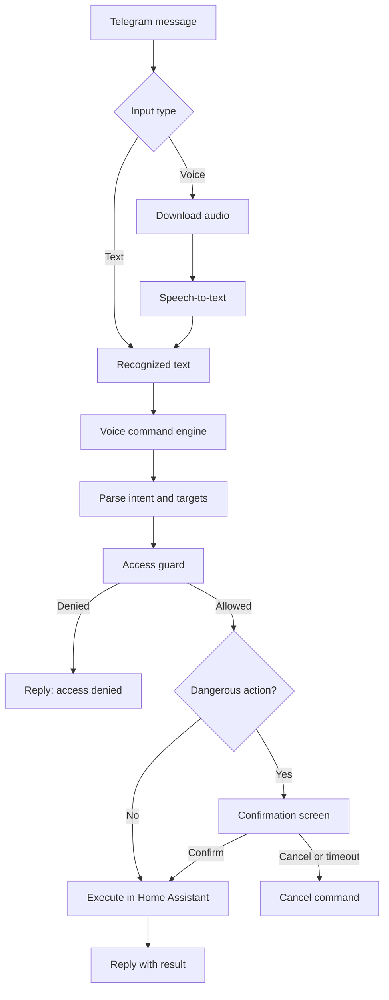
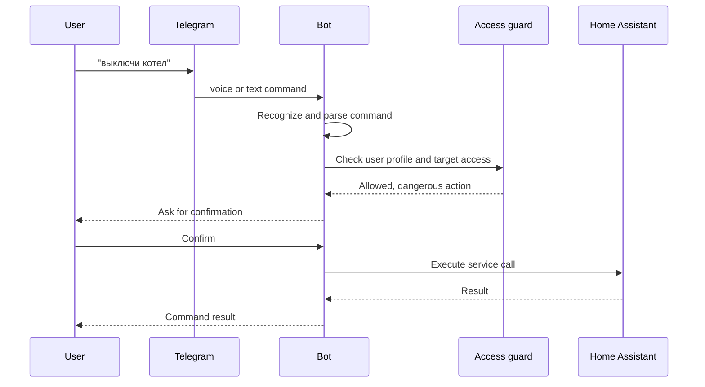
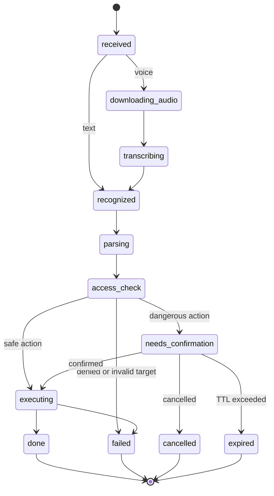

# Спецификация голосового управления

## Цель

Добавить в Telegram HA Bot голосовое управление Home Assistant через сообщения
Telegram. Пользователь отправляет voice-сообщение или текстовую команду, бот
распознает намерение, проверяет права пользователя и выполняет действие через
Home Assistant.

Главная идея: голос - это только один из способов ввода. После распознавания
аудио команда должна попадать в общий обработчик команд, который одинаково
работает для текста и voice.

## Основной сценарий

1. Пользователь отправляет voice-сообщение в Telegram.
2. Бот скачивает аудиофайл из Telegram.
3. Бот передает аудио в распознавание речи.
4. Распознанный текст отображается пользователю.
5. Бот передает текст в локальный обработчик команд бота.
6. Бот извлекает целевые комнаты, устройства и действие.
7. Бот проверяет доступ пользователя через существующие профили доступа.
8. Если действие безопасное, оно выполняется сразу.
9. Если действие критичное, бот просит подтверждение кнопкой.
10. Пользователь получает результат выполнения.

## Архитектура



## Принятое решение для MVP

В MVP Home Assistant Assist используется только как локальный STT provider:

```text
Telegram voice -> HA Assist pipeline STT -> текст -> command engine бота -> access guard -> HA service call
```

Причина: Conversation API Home Assistant может не только разобрать команду, но и
сразу выполнить intent. Для бота это риск, потому что Telegram-профили доступа
должны проверяться до выполнения действия.

Внешний STT не входит в MVP. Его можно оставить как будущий provider, но по
умолчанию голос не должен уходить во внешний сервис.

Pending voice/action confirmation хранится в SQLite. Так подтверждение не
теряется при рестарте бота, а просроченные pending-команды можно чистить тем же
maintenance worker.

Assist pipeline выбирается так:

1. если в настройках задан конкретный `voice_ha_pipeline_id`, использовать его;
2. иначе брать preferred/default pipeline из Home Assistant;
3. если pipeline не найден или в нем нет STT, показать понятную ошибку.

Декодирование Telegram OGG/Opus в PCM можно реализовать через уже подключенный
`ffmpeg-next`. Если на этапе реализации отдельный Rust-пакет заметно упростит
декодирование без внешнего процесса и без тяжелых зависимостей, его можно
добавить.

Conversation API можно использовать только для безопасных read-only запросов
или как экспериментальный режим после отдельной проверки, что команда не
управляет устройствами.

## Интеграция с Home Assistant Assist

Для первого полноценного варианта предпочтительно использовать Home Assistant
Assist pipeline для распознавания речи, потому что он может работать локально
через Whisper, Speech-to-Phrase или другой STT provider в Home Assistant.

Conversation API не должен быть основным путем выполнения команд управления в
MVP. Он может быть полезен для read-only вопросов, например:

```text
какая температура в спальне
что с датчиком двери
```

Для таких запросов можно использовать:

```http
POST /api/conversation/process
Authorization: Bearer <HA_TOKEN>
Content-Type: application/json
```

```json
{
  "text": "какая температура в спальне",
  "language": "ru",
  "agent_id": "home_assistant"
}
```

Ответ Home Assistant содержит тип результата, текст ответа и данные о целевых
сущностях. Для read-only ответов эти данные используются для проверки доступа и
красивого ответа в Telegram.

Команды управления вроде `включи свет в гостиной` в MVP должны идти через
локальный command engine бота.

Документация:

- https://developers.home-assistant.io/docs/intent_conversation_api/
- https://www.home-assistant.io/voice_control/
- https://www.home-assistant.io/voice_control/voice_remote_local_assistant

## Распознавание речи

### Вариант A: Assist pipeline в Home Assistant

Бот передает аудио в HA voice/STT pipeline, а HA возвращает распознанный текст.
Это основной вариант для MVP, если в Home Assistant уже настроены Whisper,
Speech-to-Phrase или другой локальный STT через Wyoming.

Пайплайн должен заканчиваться на стадии `stt`. Выполнение intent через Assist в
MVP не используется для команд управления.

Перед отправкой в HA аудио из Telegram нужно привести к формату, который
поддерживает pipeline:

```text
Telegram OGG/Opus -> decode -> PCM mono -> sample_rate pipeline -> binary chunks
```

Точные параметры sample rate берутся из выбранного Assist pipeline или из
настроек `voice_stt_sample_rate`.

Плюсы:

- голос может распознаваться локально;
- не нужны внешние STT API;
- логика ближе к Home Assistant;
- приватность лучше.

Минусы:

- сложнее интеграция аудиопайплайна;
- зависит от настроек HA;
- нужно учитывать поддерживаемый формат аудио.

### Вариант B: внешний STT, затем локальный command engine

Бот сам отправляет аудио в STT-сервис, получает текст и передает его в локальный
command engine.

Плюсы:

- может быть полезно как будущий fallback;
- проще отлаживать;
- можно выбрать лучший STT для русского языка.

Минусы:

- голос уходит во внешний сервис;
- нужен API-ключ;
- появляется зависимость от сети и тарифа.
- права доступа всё равно должны проверяться в боте, а не на стороне STT.

### Вариант C: локальный STT в контейнере бота

Бот содержит или вызывает локальный STT-движок.

Плюсы:

- не зависит от внешних сервисов;
- не требует специальной настройки HA voice pipeline.

Минусы:

- тяжелее Docker-образ;
- больше CPU/RAM;
- сложнее поддержка моделей.

## MVP

Первый этап должен быть небольшим и надежным.

В MVP входит:

- прием текстовых команд;
- использование уже существующего текстового command layer как общего ядра для
  text и voice;
- прием voice-сообщений Telegram;
- распознавание voice в текст;
- распознавание через HA Assist pipeline на стадии `stt`;
- отправка распознанного текста в локальный command engine;
- показ пользователю распознанной команды;
- проверка доступа по существующим профилям;
- выполнение безопасных команд;
- подтверждение критичных команд;
- понятные ошибки.

Примеры команд:

```text
включи свет в гостиной
выключи свет на кухне
поставь температуру в спальне 22
покажи снимок с камеры у входа
выключи все в гостиной
```

## Проверка доступа

Голосовая команда не должна обходить Telegram-профили доступа.

Перед выполнением бот должен проверить:

- пользователь разрешен в боте;
- пользователь имеет доступ к комнате;
- пользователь имеет доступ к устройству или камере;
- действие разрешено для типа устройства;
- действие не относится к критичным без подтверждения.

Если Home Assistant Assist выполнил действие до проверки доступа, это считается
ошибкой архитектуры. В идеале бот сначала должен получить/определить цель,
проверить права, а затем выполнять действие.

Для MVP команды управления всегда проходят через локальный command engine бота.
Conversation API не используется для выполнения unsafe/control-команд.

## Критичные действия

Следующие действия требуют подтверждения:

- управление котлом, отоплением, климатом выше заданного лимита;
- выключение всех устройств в комнате или доме;
- открытие замков, ворот, дверей;
- отключение сигнализации;
- массовые действия над большим числом устройств;
- действия с устройствами, помеченными как critical.

Критичное устройство - это устройство, ошибка управления которым может привести
к неприятным или опасным последствиям. Например:

- котел;
- теплый пол;
- замок двери;
- ворота;
- сирена;
- сигнализация;
- насос;
- реле питания важного оборудования.

Флаг `critical` нужен не для запрета управления, а для дополнительной защиты.
Если пользователь имеет доступ к устройству, но устройство помечено как
critical, бот перед выполнением голосовой команды просит подтверждение.

UX подтверждения:

```text
Распознано:
"выключи котел"

Это критичное действие.
Подтвердить выполнение?

[Подтвердить] [Отмена]
```

Pending-команда должна иметь TTL, например 60 секунд.



## Настройки

Предлагаемые поля в `options.json`:

```json
{
  "voice_enabled": false,
  "voice_stt_provider": "ha_pipeline",
  "voice_command_engine": "local_parser",
  "voice_ha_pipeline_id": null,
  "voice_stt_sample_rate": 16000,
  "voice_confirm_dangerous": true,
  "voice_pending_ttl_s": 60,
  "voice_max_audio_size_mb": 10,
  "voice_max_audio_duration_s": 30,
  "voice_stt_timeout_s": 45,
  "voice_show_recognized_text": true,
  "voice_response_format": "text"
}
```

Язык команды берется из языка интерфейса пользователя. Глобальный язык можно
добавить только как fallback, если у пользователя язык не задан.

`voice_stt_provider`:

- `ha_pipeline` - использовать Home Assistant Assist pipeline до стадии `stt`;
- `external_stt` - будущий вариант, не входит в MVP;
- `local_stt` - будущий вариант с локальной моделью в контейнере бота.

`voice_ha_pipeline_id`:

- `null` - использовать preferred/default pipeline из Home Assistant;
- строка с ID pipeline - использовать конкретный Assist pipeline.

`voice_command_engine`:

- `local_parser` - безопасный путь MVP, использует права доступа бота;
- `ha_conversation_readonly` - режим только для read-only вопросов к HA;
- `ha_conversation_full` / `ha_conversation` - полный HA Conversation для доверенных пользователей.

В профиле пользователя можно переопределить voice engine. Команды, которые
относятся к самому боту (`снимок`, `видео`, `архив`), обрабатываются ботом
даже в режиме `ha_conversation_full`; остальные фразы уходят в Home Assistant.

`voice_response_format`:

- `text` - отвечать только текстом;
- `voice` - отвечать voice-сообщением, если доступен TTS;
- `both` - отправлять текст и voice-ответ.

Свободные read-only вопросы к HA Assist можно разрешить всем известным
пользователям. Перед показом ответа бот всё равно проверяет доступ к найденным
target/success entity, если Home Assistant вернул их в response.

## Состояния команды



Эти состояния стоит логировать, чтобы понимать, где сломалась команда.

## Ошибки и ответы пользователю

Примеры ответов:

```text
Не удалось скачать голосовое сообщение.
```

```text
Не удалось распознать речь. Попробуй сказать короче.
```

```text
Я распознал: "включи свет в гостиной"
Но не нашел такую комнату или устройство.
```

```text
У тебя нет доступа к этому устройству.
```

```text
Команда выполнена: свет в гостиной включен.
```

## Безопасность

Обязательные правила:

- не выполнять команды от неизвестных пользователей;
- не логировать Telegram token, HA token и аудиофайлы;
- не хранить voice-файлы дольше, чем нужно для распознавания;
- ограничить размер аудио;
- ограничить длительность аудио;
- добавлять rate limit на голосовые команды;
- подтверждать критичные действия;
- использовать существующую модель прав доступа.

## Этапы реализации

### Этап 1. Текстовый командный движок

- ~~Добавить базовый обработчик текстовых команд.~~ Уже есть
  `src/bot/text_commands.rs`.
- Расширить существующий текстовый слой до общего command engine для text и
  voice.
- Описать структуру `CommandIntent`.
- Унифицировать результат выполнения команды.
- Добавить unit-тесты парсинга и проверки доступа.

### Этап 2. HA Assist STT pipeline

- Добавить WebSocket-команду запуска `assist_pipeline/run`.
- Получать список pipeline и выбранный pipeline id.
- Запускать pipeline со `start_stage = "stt"` и `end_stage = "stt"`.
- Декодировать Telegram OGG/Opus в PCM mono.
- Отправлять аудио бинарными чанками в HA.
- Получать распознанный текст и отдавать его в command engine.

### Этап 3. Voice-сообщения Telegram

- Добавить обработку `MessageKind::Voice`.
- Скачать файл через Telegram API.
- Ограничить размер и длительность.
- Передать аудио в выбранный STT provider.
- Отправить распознанный текст в общий command engine.

### Этап 4. Подтверждения

- Добавить SQLite-таблицу pending voice/action session.
- Реализовать кнопки подтверждения и отмены.
- Добавить TTL и очистку просроченных команд.
- Восстанавливать pending-команды после рестарта только если TTL еще не истек.

### Этап 5. Админские настройки

- Добавить включение/выключение voice в админке.
- Добавить выбор provider.
- Показывать, что язык берется из языка интерфейса пользователя.
- Добавить право `can_use_voice` в профиль пользователя.
- Добавить флаг `critical` в настройки устройства.

### Этап 6. Conversation API для read-only запросов

- Добавить метод в `HomeAssistantClient`:
  `process_conversation(text, language, agent_id)`.
- Разрешить только query/read-only сценарии.
- Перед показом ответа проверять доступ к target/success entity из ответа HA.
- Не использовать этот путь для команд управления устройствами.

## Acceptance Criteria

- Voice от неизвестного пользователя не выполняется.
- Voice от пользователя без доступа к комнате или устройству не выполняется.
- Voice от пользователя без `can_use_voice` не выполняется.
- Распознанный текст показывается пользователю, если включен
  `voice_show_recognized_text`.
- Команды управления проходят через локальный command engine, а не через
  Conversation API.
- Критичная команда создает pending confirmation.
- Pending confirmation истекает по `voice_pending_ttl_s`.
- Pending confirmation хранится в SQLite и переживает рестарт в пределах TTL.
- Telegram voice больше лимита размера или длительности отклоняется.
- Временный аудиофайл удаляется после распознавания.
- Ошибки STT не содержат токены и путь к приватному аудио.
- Язык STT берется из языка интерфейса пользователя.

## Принятые решения

- Свободные read-only вопросы к HA Assist разрешены всем известным
  пользователям, если они не обходят доступы к комнатам и устройствам.
- Формат ответа настраивается через `voice_response_format`.
- Критичность хранится как флаг устройства в настройках устройства.
- В профиль пользователя добавляется отдельное право `can_use_voice`.
- Pending confirmation хранится в SQLite.
- По умолчанию используется preferred/default Assist pipeline из Home
  Assistant.
- Telegram OGG/Opus декодируется в PCM через `ffmpeg-next` или отдельный
  подходящий Rust-пакет, если он упростит реализацию.

## Рекомендуемый старт

Начать с расширения существующего текстового command layer до общего command
engine. После этого добавить HA Assist STT pipeline и voice-вход как отдельный
слой.

Такой порядок снижает риск: если распознавание речи ошибется, ядро команд,
права доступа и подтверждения уже будут проверены на обычном тексте.
